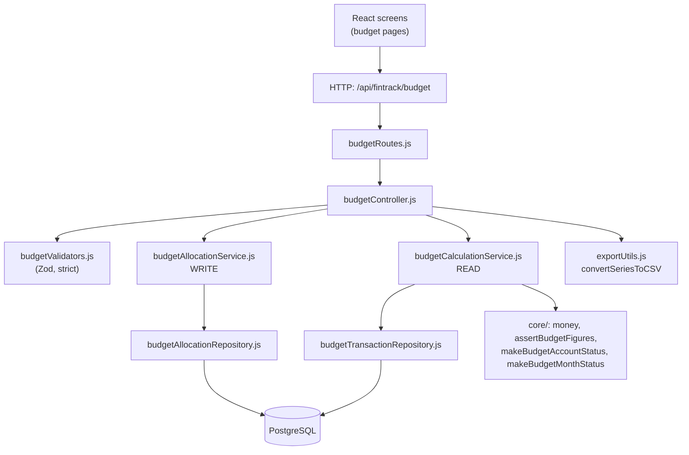
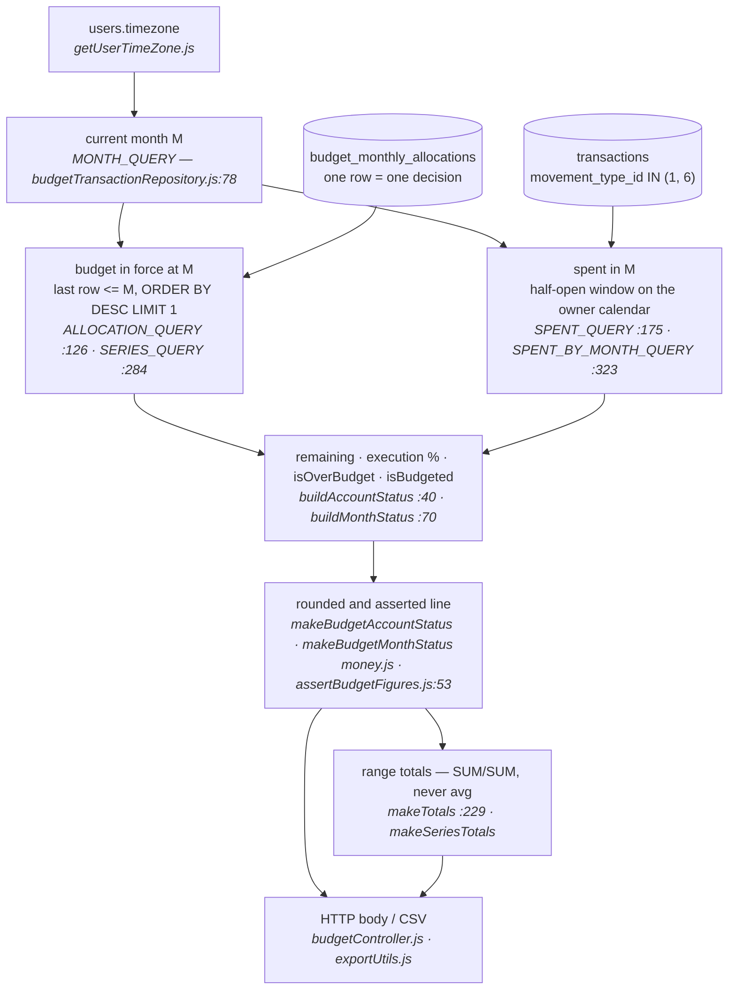
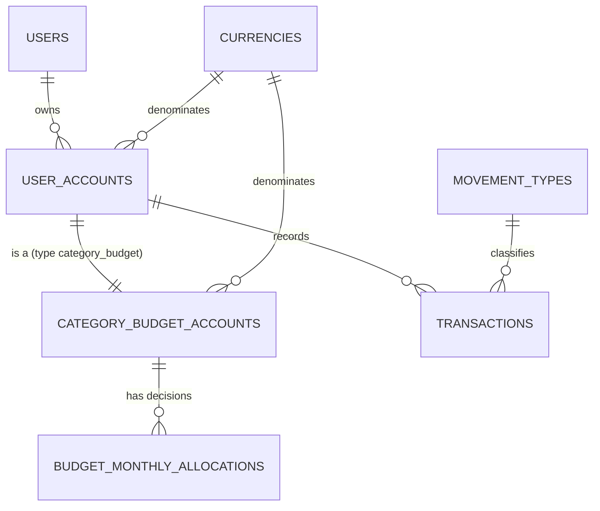
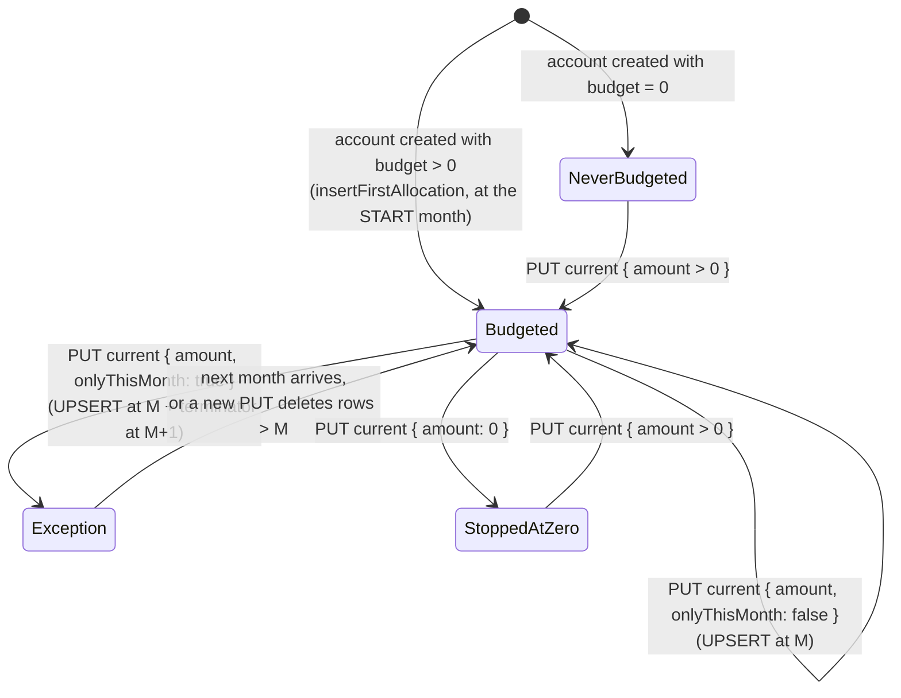
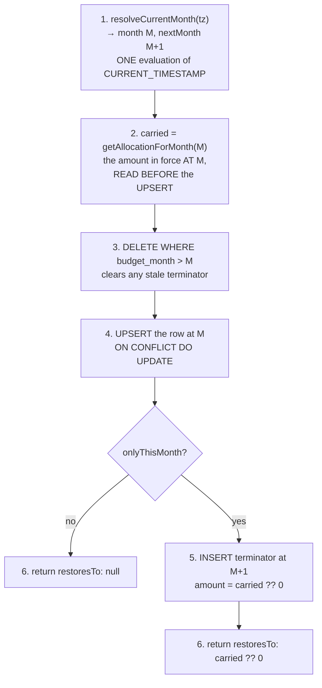

# Budget V1 — Technical Guide

Reconstructed from the repository state on branch `feat/budget` at commit `0e6cb1a`,
measured 2026-08-12. Every claim below was read out of code, SQL, or a live query
against the local database. Where the documentation and the code disagree, the
disagreement is reported as a FINDING (§31) and **not** silently corrected.

This is an analysis document. No code was modified to produce it.

---

## 1. Executive overview

### The problem

FinTrack lets a user assign a monthly budget to an expense category account and
asks one question about it: *how much of this month's budget have I spent?*

The figure the user reads on screen today does not answer that question. The
dashboard computes:

```sql
(COALESCE(SUM(cba.budget), 0) - SUM(ua.account_balance))::FLOAT AS total_remaining
```

`dashboardController.js:347`. `cba.budget` is a **monthly** amount.
`ua.account_balance` is a **running lifetime** column, updated on every
transaction (`transactionController.js:138`) and never reset by period. The
subtraction is therefore *monthly budget − lifetime spending*, a number that
degrades every month forever and can never recover.

### The fix

One table, `budget_monthly_allocations`, holding one row per user decision:
*"this account has this amount from this month onwards"*. Every read resolves the
budget in force for a month as the last row at or before it, and compares it
against spending bucketed into that same month on the account owner's calendar.

### Where the work stands

| Phase | Commits | State |
|---|---|---|
| Schema + write path | 1, 1b | Landed (`3b72371`, `adc1150`) |
| Backend read path | 2, 3 | Landed (`efad4c3`, `0e6cb1a`) |
| Frontend | 5–10 | **Not started.** Zero code |
| Closure / legacy retirement | 11–13 | Not started |

The backend of V1 is complete: four routes, all shipped. The frontend still reads
the legacy column through endpoints outside the budget module, which is why the
broken number is still the one on screen. Commit 9 is where that changes.

Commit 4 does not exist as a separate landed commit — the write endpoint shipped
inside commit 2 (`efad4c3`, "rebuild the budget api"). See FINDING F-16.

---

## 2. Mental model

### How to think Budget V1

```
 Budget V1
 │
 ├── Budget account            → a row in category_budget_accounts
 │
 ├── Monthly decisions         → rows in budget_monthly_allocations
 │     ├── amount                 (DECIMAL(15,2), >= 0)
 │     └── month it takes effect  (DATE, always day 1)
 │
 ├── Actual spending           → rows in transactions (movement_type 1 and 6)
 │
 ├── Month status              → budget / spent / remaining / execution %
 │     (computed, never stored)
 │
 └── Month series              → the same status, one entry per month
       (the aggregation primitive for every range question)
```

### The one sentence that explains the schema

> A row of `budget_monthly_allocations` is a **decision the user took**, not a
> snapshot of the budget in each month.

Everything follows from that. If a row were a snapshot, every month would need
one, and a twelve-month history would need twelve rows written by somebody. As a
decision, a single row covers every month after it until another decision
replaces it. The user set $300 in June and has not touched it since: that is one
row, and July, August and September all read $300 from it.

This is why there is **no `recurring` column**. "This budget recurs" is not a
property to store; it is the observation that no later row terminates it. A
column would be a second source of truth for one fact, and the two can disagree —
whereupon the module has to decide which one lies.

### The three levels this document keeps separate

| Level | Question it answers | Where it lives here |
|---|---|---|
| **1 — Conceptual** | What is a budget in this product? | §2, §4, §6 |
| **2 — Architectural** | Who is responsible for what? | §3, §27, §28, §29 |
| **3 — Implementation** | Which file, function and SQL? | §14–§20, §18 |

---

## 3. Architecture



Four layers, and the rule that separates them:

| Layer | Owns | Must never |
|---|---|---|
| Controller | HTTP, authentication, **authorization**, status codes | Contain arithmetic |
| Validator | Shape, format, unknown keys | Know today's date |
| Service | Domain rules, folds, range resolution | Issue SQL |
| Repository | SQL, and only SQL | Decide whether a write is allowed |
| Core | Rounding, invariants, response shapes | Reach the database |

The one deliberate crossing: **the current month is resolved in SQL**, not in
JavaScript, at `budgetAllocationRepository.js:34` and
`budgetTransactionRepository.js:78`. §13 explains why.

### 3.1 The calculation pipeline, annotated by file

§3 says who owns what. This says **which file performs each transition** — the
path a single number walks from a stored decision to a rendered figure. Every
arrow is a transformation, and every transformation has exactly one owner.



Read as a table, with the rule each step applies:

| # | Transition | Performed by | Rule it applies |
|---|---|---|---|
| 1 | request → owner calendar | `getUserTimeZone.js`, once per request at the controller | I-5: the zone is the **owner's**, never the device's |
| 2 | calendar → month `M` | `MONTH_QUERY` / `resolveCurrentMonth`, in **SQL** | One evaluation of `CURRENT_TIMESTAMP` yields M and M+1 together |
| 3 | rows + `M` → **budget in force** | the `<= M … DESC LIMIT 1` resolution — **three SQL copies** (Q2, Q3, Q5) | I-1, I-2. Absence means the month precedes the first allocation; it is not defaulted to 0 in SQL |
| 4 | transactions + `M` → **spent** | `SPENT_QUERY` (one month), `SPENT_BY_MONTH_QUERY` (a range) | I-6: both sides bucketed on the same calendar, exactly one conversion per operand |
| 5 | budget + spent → **remaining, %, flags** | `buildAccountStatus` / `buildMonthStatus` | I-8: zero budget has **no** percentage. No branch for the unbudgeted account |
| 6 | figures → **a valid line** | the two factories, over `money.js`, guarded by `assertBudgetFigures` | I-10 rounding at the boundary; I-3 checked one-directionally |
| 7 | lines → **totals** | `makeTotals`, `makeSeriesTotals` | I-9: the backend folds. Summed **from** the rounded lines so the header reconciles |
| 8 | totals + lines → **response** | `budgetController.js`, `exportUtils.js` | The four bodies of §15; no arithmetic lives here |

Three things this diagram makes visible that the layer table does not:

- **Step 3 is the only place recurrence exists**, and it exists three times. They
  are three copies of one rule (§30 marks the pair as Critical).
- **Steps 3 and 4 never meet in SQL.** They are separate queries joined in
  JavaScript at step 5 — §9 explains why joining them multiplies spending by the
  number of allocation rows.
- **Nothing after step 6 touches the database, and nothing before it rounds.**

---

## 4. Domain model

### 4.1 Entities

| Entity | Table | Cardinality |
|---|---|---|
| User | `users` | — |
| Account | `user_accounts` | 1 user → N accounts |
| Budget account | `category_budget_accounts` | 1:1 with a `user_accounts` row of type `category_budget` |
| Monthly allocation | `budget_monthly_allocations` | 1 account → N allocations, one per decided month |
| Transaction | `transactions` | 1 account → N transactions |

### 4.2 Recurrence, drawn

Two rows in the table:

```
 rows:      Aug = 300          Sep = 700
            │                  │
 timeline:  Aug──Sep──Oct──Nov──Dec──…
            300  700  700  700  700   ← what each month reads
```

August's row rules August. September's row replaces it and rules from September
onwards, forever, because nothing follows it.

### 4.3 The exception (`onlyThisMonth`)

The user is in September, sets 700, and checks *"apply to this month only"*.
The write produces **two** rows:

```
 rows:      Aug = 300   Sep = 700   Oct = 300  ← terminator
            │           │           │
 timeline:  Aug──Sep────Oct──Nov────Dec──…
            300  700    300  300    300
```

The October row is a **terminator**: it exists solely to stop September's amount
from carrying forward, by restoring what was in force before it. Under
carry-forward, an *absent* row terminates nothing — the previous row keeps
governing — so the only way to express "go back to 300" is to write 300 at
October.

### 4.4 Rollover does not exist

```
 September budget = 700
 September spent  = 500
 leftover         = 200

 October budget   = 700     ← the amount in force in October
 October budget   ≠ 900
```

There is no balance entity for a surplus to accumulate into, and V1 forbids one
(decision 3, `PLAN_BUDGET_V1 §0`). This is an architectural invariant, **not** a
feature pending implementation. Do not present it as a roadmap item.

---

## 5. Database model

### 5.1 The table

`010_create_budget_tables.sql` — verified against the live schema:

```sql
CREATE TABLE IF NOT EXISTS budget_monthly_allocations (
 budget_allocation_id SERIAL PRIMARY KEY,
 account_id           INTEGER       NOT NULL
  REFERENCES category_budget_accounts(account_id) ON DELETE CASCADE,
 budget_month         DATE          NOT NULL,
 budget_amount        DECIMAL(15,2) NOT NULL CHECK (budget_amount >= 0),
 created_at           TIMESTAMPTZ   NOT NULL DEFAULT CURRENT_TIMESTAMP,
 updated_at           TIMESTAMPTZ   NOT NULL DEFAULT CURRENT_TIMESTAMP,
 CONSTRAINT uq_budget_allocation_month UNIQUE (account_id, budget_month),
 CONSTRAINT chk_budget_month_is_first CHECK (EXTRACT(DAY FROM budget_month) = 1)
);
```

### 5.2 Why each column is what it is

| Decision | Reason |
|---|---|
| `budget_month DATE` pinned to day 1, not `(year, month)` | `<=`, `ORDER BY` and `generate_series` work natively; no composite comparison |
| `CHECK (budget_amount >= 0)`, not `> 0` | A zero row is the only way to express "stop budgeting" under carry-forward. The **form** rejects 0; only the explicit remove action writes it |
| No `currency_id` | Inherited from `category_budget_accounts.currency_id`, which migration 011 makes NOT NULL. A copy can drift |
| No `recurring` column | §2 — recurrence is the ordering of rows |
| No extra index | `uq_budget_allocation_month` is exactly the index the `<= M ORDER BY … DESC LIMIT 1` resolution needs; Postgres walks its btree backwards |
| `EXTRACT(DAY …) = 1`, not `date_trunc` | `date_trunc(text, timestamptz)` is STABLE, not IMMUTABLE, so it cannot appear in a CHECK |

### 5.3 ER diagram — only relations that exist



`users.timezone` is not a relation but is load-bearing: it decides which month
"now" is and which month a transaction falls in.

### 5.4 Tables that still physically exist and should not

Queried live, 2026-08-12:

```
 budget_frequency_types      ← present in the local DB
 budget_monthly_allocations  ← the V1 table
 budget_policies             ← present in the local DB
 budget_policy_allocations   ← present in the local DB
 category_budget_accounts
```

**No current DDL creates the three legacy tables.** Migration 010 was rewritten in
place (§10.1 of the plan) and `createTables.js` / `ensureBudgetTables()` create
only `budget_monthly_allocations`. They survive in this database because an
earlier boot created them, and **no migration drops them yet** — that migration is
part of commit 13. See F-09.

### 5.5 Two build paths, and why that matters

The schema is defined **twice**:

| Path | File | Reaches |
|---|---|---|
| Migration runner | `db/migrations/sql_migrations/010`, `012` | Databases built with `npm run db:migrate` |
| Runtime initializer | `createTables.js` → `ensureBudgetTables()`, `ensureBudgetAllocationBackfill()` | **Production**, which boots through `initDatabase.js` |

This duplication has already caused one divergence: production created the budget
tables through the runtime path and never backfilled, leaving every legacy budget
invisible to the read path. The rule that closes it: **every change to 010 or 012
is applied to the runtime path in the same commit.**

`ensureBudgetTables()` and `ensureBudgetAllocationBackfill()` run on **every
boot** (`initDatabase.js:164,173`), outside the first-time initialization block —
because that block is skipped on any database that already existed.

---

## 6. Invariants that must never break

Collected from `PLAN_BUDGET_V1`, the SQL constraints, and the guards in
`assertBudgetFigures.js`. Each states where it is enforced.

### I-1 — Resolution

```
 inForce(account, M) = the last row with budget_month <= M, ordered DESC, LIMIT 1
```

Enforced in SQL in three places, identically:
`budgetAllocationRepository.js:52` (`getAllocationForMonth`),
`budgetTransactionRepository.js:126` (`ALLOCATION_QUERY`, `DISTINCT ON`),
`budgetTransactionRepository.js:284` (`SERIES_QUERY`, correlated subquery).

### I-2 — Recurrence

A row is in force from its month until a later row replaces it. There is no
column, no end date, no `valid_until`. Enforced by the absence of one.

### I-3 — `isBudgeted` is existence

```
 isBudgeted = a row exists at or before M
 isBudgeted ≠ budgetAmount > 0
```

Therefore `budgetAmount = 0, isBudgeted = true` is a **valid and meaningful**
state. Enforced at `assertBudgetFigures.js:53`:

```js
 if (!isBudgeted && toAmount(amounts.budgetAmount) !== 0) {
  throw new Error(`${label}: an unbudgeted entry cannot carry an amount`);
 }
```

Only one direction is checkable — an unbudgeted entry cannot carry an amount,
while a budgeted one is free to carry 0.

**The two empty states:**

| State | Rows | `isBudgeted` | `budgetAmount` | Screen |
|---|---|---|---|---|
| Before the account's first allocation | none at or before M | `false` | `0` | *"Sin presupuesto"* |
| Budgeted at zero | a row with `0` | `true` | `0` | *"Presupuesto: $0"* |

Arithmetically identical; two different sentences. Collapsing them in the API is
what `isBudgeted` exists to prevent.

**The first state belongs to a month, never to an account created by this
system.** `accountCategoryCreationcontroller.js:259` calls
`createAllocationForAccount` unconditionally, and `normalizeAmount:44` answers
`400` when no amount arrives — so a new account always owns a row. `false`
survives for months of a `/series` range that precede that row, and for legacy
accounts the Supabase backfill skips.

### I-4 — No rollover

`budget(M)` does not depend on `spent(M-1)`, `remaining(M-1)` or anything else
about M-1. Enforced by the absence of any accumulator.

### I-5 — Temporal

`M` is derived server-side, from `CURRENT_TIMESTAMP` and the **account owner's**
`users.timezone`:

```sql
 SELECT date_trunc('month', CURRENT_TIMESTAMP AT TIME ZONE $1)::date::text AS month
```

Never from the request, never from the browser. Enforced by every Zod schema
being `.strict()` with no month field to send.

### I-6 — Both sides of the comparison live on the same calendar

The budget's month and the transaction's month are resolved on the same zone.
Enforced in `SPENT_QUERY` and `SPENT_BY_MONTH_QUERY` (§16).

### I-7 — No monetary field is null, except under mixed currencies

The absence of a budget travels in `isBudgeted` and nowhere else. An unbudgeted
account reports `budgetAmount: 0` and a real `actualSpent`, so `remainingBudget`
comes out negative — which is what being in the red means, and what `null` failed
to say. Enforced at `makeBudgetAccountStatus.js` / `makeBudgetMonthStatus.js`.

### I-8 — Zero has no percentage

`executionPercentage` is `null` when `budgetAmount === 0` — not `0` (reads as
"spent nothing"), not `Infinity`. Its absence is the fact.

### I-9 — The backend folds, the client never does

A range percentage is `SUM(actual) / SUM(budget)`, recomputed — never the average
of monthly percentages. Enforced by shipping `totals` in every response so no
client has a reason to fold.

### I-10 — Rounding happens at boundaries only

`core/money.js` owns the scale (2), the mode (`ROUND_HALF_UP`, chosen for parity
with Postgres numeric) and the maximum (`DECIMAL(15,2)`). Nothing inside a
calculation chain rounds; totals are summed **from** the already-rounded line
values so a header always reconciles with the rows under it.

---

## 7. Budget lifecycle



`NeverBudgeted` and `StoppedAtZero` are **different states** with the same
arithmetic (I-3).

---

## 8. Write workflow

### 8.1 The path

```
 UI (not built yet — commit 7)
  ↓  PUT /api/fintrack/budget/accounts/:accountId/current   { amount, onlyThisMonth }
 app.js:159            verifyToken
 routes/index.js:23    → /budget
 budgetRoutes.js:26    → setCurrentBudget
 budgetController.js:105
   ├── requireUserId(req)
   ├── currentBudgetParamsSchema.parse(req.params)   → 400 on failure
   ├── currentBudgetBodySchema.parse(req.body)       → 400 on failure
   └── getUserTimeZone(pool, userId)
 budgetAllocationService.js:199  setCurrentMonthBudget
   ├── pool.connect() + BEGIN
   ├── lockOwnedAccount()        → 403 if not owned    (SELECT … FOR UPDATE)
   ├── normalizeAmount()         → 400 on bad amount
   ├── writeAllocation()         ← the six steps below
   └── COMMIT  (ROLLBACK on any throw, always release())
 → 200 with the §7.4 body
```

### 8.2 `writeAllocation` — the six steps

`budgetAllocationRepository.js:107`. Every one fails silently if dropped, and the
failure surfaces a month later.



**Why step 3 exists.** Without it, a save that switches an exception back to
recurring leaves the old terminator in place, and next month silently reverts to
an amount nobody chose. It is safe only because V1 lets no user author a future
month — the only row that can exist beyond M is a terminator this same routine
wrote. That constraint is the V2 boundary (§13 of the plan).

**Why step 5 uses `carried ?? 0` instead of skipping the insert.** With nothing to
return to, the next month must read as "no budget". Only a row can stop the
carry-forward; skipping the insert would carry the exception amount forward
forever — the exact opposite of what the caller asked.

### 8.3 The other write path

| Path | Function | Month it writes | Exception? |
|---|---|---|---|
| Account creation | `createAllocationForAccount` → `insertFirstAllocation` | The **account's start month**, not the current one | No — the creation form has no checkbox (decision 5) |
| Budget screen | `setCurrentMonthBudget` → `writeAllocation` | Current month | **Yes** |

`insertFirstAllocation` dates the row at the account's start month so a backdated
account does not report "no budget" for the months between its start and its
creation.

There is no third path. The account editor used to carry one — it wrote the
amount with no conversion and left the FX columns describing the account's
creation, which is the failure migration 014 exists to prevent — and it was
retired once the budget block took over the amount. An account created before
`budget_monthly_allocations` existed is repaired by the backfill, migration 012
and its runtime twin `ensureBudgetAllocationBackfill`, not by an edit.

### 8.4 Transaction ownership

| Caller | Receives | Why |
|---|---|---|
| `setCurrentMonthBudget` | a **pool**, opens its own transaction | The allocation and its terminator are one decision; a terminator committed without its allocation reverts a budget nobody changed |
| `createAllocationForAccount` | a **client** | Account creation already owns a transaction; an allocation on its own connection would outlive a rollback of the account it belongs to |

---

## 9. Read workflow

```
 UI (commit 8)
  ↓  POST /api/fintrack/budget/accounts/status  { accountIds: [13, 19] }
 budgetController.js:67  getBudgetAccountsStatus
   ├── requireUserId
   ├── budgetAccountsStatusBodySchema.parse(body)        → 400
   ├── getOwnedBudgetAccounts(userId)  → check EVERY id  → 403
   └── getUserTimeZone(pool, userId)
 budgetCalculationService.js:275  getBudgetAccountsStatus
   └── budgetTransactionRepository.js:204  getMonthlyStatusForAccounts
        ├── MONTH_QUERY            → month, nextMonth
        └── Promise.all([
             ACCOUNTS_QUERY,       → identity + currency_id
             ALLOCATION_QUERY(M),  → budget in force this month
             ALLOCATION_QUERY(M+1),→ budget in force next month
             SPENT_QUERY(M, M+1)   → actual spending this month
            ])
   ├── buildAccountStatus per row  → makeBudgetAccountStatus (rounds, asserts)
   ├── makeTotals(statuses)        → mixed-currency branch
   └── meta.notices + meta.currentMonth (free: already resolved above)
 → 200
```

**Four queries, not N+1.** Spending is aggregated on its own rather than LEFT
JOINed onto the allocations: joined, an account with N allocation rows produced N
rows each carrying the full period spend, and any sum over them multiplied the
real spending by N. Keeping the aggregate separate makes the fan-out *impossible*,
not merely avoided.

---

## 10. Monthly series

The series is **the aggregation primitive**. Every range question — quarter, year,
accumulated, averages — is a fold over it, and the fold is performed by the
**backend**, in `makeSeriesTotals`.

```
 Month      Budget   Spent   Remaining   Exec %   isBudgeted
 --------------------------------------------------------------
 2026-06     300      250        50       83.33      true
 2026-07     300      280        20       93.33      true
 2026-08     700      500       200       71.43      true
```

Every month between `from` and `to` is present, with **no gaps**, including months
before the account's first allocation (`isBudgeted: false`, `budgetAmount: 0`). A
gap would force the client to re-derive the carry-forward, which is the exact
calculation the endpoint exists to centralise.

### Range totals — what each field means

| Field | Rule | Why it is not the obvious thing |
|---|---|---|
| `budgetAmount` | `SUM(months.budgetAmount)` | — |
| `actualSpent` | `SUM(months.actualSpent)` | — |
| `remainingBudget` | difference of the two sums | — |
| `executionPercentage` | `SUM(actual) / SUM(budget) × 100` | **Never** `avg(month.executionPercentage)`. An average weights a $10 month the same as a $10,000 month |
| `budgetedMonthCount` | `months.filter(isBudgeted).length` | A month set to **zero counts** — budgeted is the existence of the decision |
| `monthsOverBudget` | `months.filter(isOverBudget).length` | — |
| `averageMonthlySpend` | `SUM(actual) / months.length` | Divided by **every** month in the range, not by the budgeted ones. Spending happens whether budgeted or not; dividing by the budgeted months reports an average higher than any month actually spent |

**This is not ambiguous and must not become so: the folds belong to the backend.**
The three folds a client must never write are exactly the three right-hand
columns above.

---

## 11. `onlyThisMonth`

### QUÉ ES

A boolean on the write payload. `false` (the default, and the unnamed normal
case) means the amount recurs. `true` means it applies to the current month only.

### POR QUÉ EXISTE

Because both mistakes are possible and they do not cost the same:

| Mistake | Consequence |
|---|---|
| Checked by accident | The amount drops back **silently** next month |
| Left recurrent by accident | $700 keeps showing into January — **visible**, and self-correcting |

The default belongs where the failure is loud. Hence unchecked by default
(decision 6).

### DÓNDE VIVE

`budgetValidators.js:71` (`z.boolean().default(false)`),
`budgetAllocationService.js:204`, `budgetAllocationRepository.js:111,144`.

### Case A — recurrent change

```
 BEFORE                      ACTION                       AFTER
 Jul = 300                   set Aug = 700                Jul = 300
 Aug = 300                   onlyThisMonth = false        Aug = 700
                                                          (nothing after)

 timeline: Jul 300 │ Aug 700 │ Sep 700 │ Oct 700 │ …
```

### Case B — one-month exception

```
 BEFORE                      ACTION                       AFTER
 Jul = 300                   set Aug = 700                Jul = 300
 (Aug reads 300 by carry)    onlyThisMonth = true         Aug = 700
                                                          Sep = 300  ← terminator

 timeline: Jul 300 │ Aug 700 │ Sep 300 │ Oct 300 │ …
```

Response:

```json
 { "restoresTo": 300.00, "restoresFrom": "2026-09-01" }
```

which is what renders §7.1's helper text: *"From September it goes back to $300."*

### `carried` — the number the terminator restores

```
 carried = the amount in force AT M      ✔  (getAllocationForMonth, <= M)
 carried = the amount in force BEFORE M  ✘  (getAllocationBefore,   <  M)
```

and it must be read **before** the UPSERT overwrites the row at M. §12 is the
whole story.

---

## 12. R41 / D-1 — the historical bug

### Before

`writeAllocation` computed `carried` with `getAllocationBefore(client, accountId, month)`,
whose predicate is `budget_month < M`.

### The defect

Once a row exists **at** M, `< M` and `<= M` return different numbers. The
terminator must restore *what was in force*, which is the row at M whenever one
exists.

### After (`adc1150`)

`getAllocationForMonth`, predicate `budget_month <= M`, called at
`budgetAllocationRepository.js:119` — **before** the DELETE and the UPSERT.

### Why both conditions are needed simultaneously

| Condition | What it alone fails to prevent |
|---|---|
| `<= M` only, read after the UPSERT | The read returns the amount just written, so the terminator restores the *new* amount and the exception is a no-op |
| Read before, `< M` only | The read skips a row that already exists at M, so the terminator restores an amount that stopped being in force before the user ever opened the form |

### The three scenarios that demonstrated it

**Scenario 1 — baseline two months earlier.** No row at M.

```
 before:   Jun = 300                        (Aug reads 300 by carry)
 action:   set Aug = 700, onlyThisMonth
 expected: Jun = 300, Aug = 700, Sep = 300
 old code: <  M → 300  ✔ (accidentally correct: there is no row at M)
 new code: <= M → 300  ✔
```

**Scenario 2 — baseline created at M.** This is the one that broke.

```
 before:   Jun = 300, Aug = 500            (the user already edited August)
 action:   set Aug = 700, onlyThisMonth
 expected: Jun = 300, Aug = 700, Sep = 500
 old code: <  M → 300  ✘  Sep reverted to June's amount, not August's
 new code: <= M → 500  ✔
```

**Scenario 3 — a terminator already exists.**

```
 before:   Jul = 300, Aug = 700, Sep = 300  (an exception set last week)
 action:   set Aug = 900, onlyThisMonth
 step 2:   carried = inForce(Aug) = 700     ← read BEFORE anything is written
 step 3:   DELETE > Aug                     → the old Sep = 300 is removed
 step 4:   UPSERT Aug = 900
 step 5:   INSERT Sep = 700
 after:    Jul = 300, Aug = 900, Sep = 700
```

Note what scenario 3 shows: correcting an exception restores **the exception's own
previous amount**, not the pre-exception baseline. That is the documented
behaviour of a model where the only writable month is the current one.

---

## 13. Timezone model

### The two directions, and why exactly one conversion each

`AT TIME ZONE` in PostgreSQL is two different operators depending on the operand
type:

| Direction | Expression | Meaning |
|---|---|---|
| instant → local calendar | `timestamptz AT TIME ZONE 'America/Bogota'` | *"which wall-clock date was it there?"* → yields `TIMESTAMP` |
| local calendar → instant | `timestamp AT TIME ZONE 'America/Bogota'` | *"what instant does that wall clock name?"* → yields `TIMESTAMPTZ` |

**Two conversions in either direction is the bug.** Each query in this module
applies exactly one, on the operand that needs it.

### Which month is "now"

```sql
 date_trunc('month', CURRENT_TIMESTAMP AT TIME ZONE $1)::date::text
```

instant → local. `MONTH_QUERY`, `budgetTransactionRepository.js:78`, and the
identical expression in `resolveCurrentMonth`.

### Which month a transaction belongs to

```sql
 date_trunc('month', t.transaction_actual_date AT TIME ZONE $4)::date::text
```

instant → local. `SPENT_BY_MONTH_QUERY`, `:323`.

### Which instants bound a month

```sql
 t.transaction_actual_date >= ($2::timestamp AT TIME ZONE $4)
 t.transaction_actual_date <  ($3::timestamp AT TIME ZONE $4)
```

local → instant. `SPENT_QUERY`, `:175-176`.

**`::timestamp` is load-bearing.** With a bare `date`, PostgreSQL resolves to the
`TIMESTAMPTZ` overload — because that is the preferred type of the category — and
converts the bound **out** to local time, the opposite direction. Measured:
`'2026-08-01' AT TIME ZONE 'America/Bogota'` yields `2026-07-31 19:00` instead of
`2026-08-01 05:00+00`. The month shifts five hours the wrong way and every
boundary transaction lands in the neighbouring month.

### Worked example

Owner zone `America/Bogota` (UTC−5). A purchase at **2026-08-31 20:00 local** is
stored as `2026-09-01 01:00+00`.

| Comparison | Result |
|---|---|
| Bare bounds, session zone UTC | The instant is ≥ September's bound → counted in **September** |
| `::timestamp AT TIME ZONE 'America/Bogota'` | August runs `2026-08-01 05:00+00` … `2026-09-01 05:00+00`; the instant falls inside → counted in **August** ✔ |

The second is correct: the user made that purchase in August, and it must be
compared against August's budget.

### Why months travel as text, never as `DATE`

A pg `DATE` crossing the node driver becomes a JS `Date` at the **process's local
midnight**. Send it back as a parameter and it resolves through the session's
zone — the owner's calendar lost on the way out and again on the way in. Text has
no zone to lose. Hence `::date::text` everywhere, and
`MONTH_PATTERN = /^\d{4}-\d{2}-01$/` in `makeBudgetMonthStatus.js` as the guard
that keeps a `Date` from being reintroduced by a later caller.

Month arithmetic follows the same rule: `monthIndex` / `shiftMonths`
(`budgetCalculationService.js:94-104`) count months as integers, never through
`Date`.

### `getUserTimeZone`

`SELECT timezone FROM users WHERE user_id = $1`, falling back to `'UTC'`. Fetched
**once per request, at the controller**, and passed down — no service resolves
identity on its own.

---

## 14. Calculations

### 14.1 Per account, per month

`buildAccountStatus`, `budgetCalculationService.js:40`:

| Figure | Formula |
|---|---|
| `budgetAmount` | the amount in force at M, or `0` |
| `actualSpent` | `SUM(amount)` over `movement_type_id IN (1, 6)` in M |
| `remainingBudget` | `budgetAmount − actualSpent` |
| `executionPercentage` | `budgetAmount === 0 ? null : actualSpent / budgetAmount × 100` |
| `isOverBudget` | `actualSpent > budgetAmount` |
| `isBudgeted` | a row exists at or before M |
| `nextMonthBudget` | the same resolution at M+1 |

There is deliberately **no branch** for the unbudgeted account: its budget is 0, so
remaining comes out negative and `isOverBudget` comes out true, which is exactly
its situation. The one thing 0 cannot produce is a percentage.

Worked:

```
 budget = 700.00
 spent  = 500.00
 remaining  = 200.00
 execution  = 71.43 %      (500 / 700 × 100, ROUND_HALF_UP at 2)
 isOverBudget = false
```

```
 budget = 0        (month before the first allocation)
 spent  = 150.00
 remaining  = -150.00      ← the amount the user is in the red by
 execution  = null         ← not 0, not Infinity
 isOverBudget = true
 isBudgeted   = false
```

### 14.2 Spending, signed

`movement_type_id = 1` is *expense*, `6` is *transfer*. For a
`category_budget` account, an expense carries a **positive** amount and a transfer
*out of* the category carries a **negative** one, so a plain `SUM` over both
yields net spending. Reversals therefore reduce `actualSpent` correctly.

### 14.3 Rounding

`core/money.js`, applied only at the factories and the export:

| Constant | Value | Note |
|---|---|---|
| `AMOUNT_SCALE` | 2 | Becomes per-currency when P6 lands |
| `RATE_SCALE` | 2 | Separate constant so a rate can diverge from an amount |
| `ROUNDING` | `ROUND_HALF_UP` | Parity with Postgres numeric, including for negatives |
| `MAX_AMOUNT` | `9999999999999.99` | `DECIMAL(15,2)`; callers **reject** past it rather than clamp |
| `MINIMUM_AMOUNT` | `0.01` | Derived from the scale. Valid only because all five seeded currencies are scale 2 |

A private `Decimal.clone()` is used, not the shared constructor: `fx_services`
imports the same module, and a `Decimal.set()` anywhere would change this module's
rounding at a distance.

### 14.4 What is confirmed absent

Verified by reading the whole `budget_services` tree: **no** `frequency`, no
`monthsPerPeriod` in any calculation, no `floor(...)`, no
`monthlyEquivalentBudget`, no `resolution` vocabulary, no `MIXED_PERIOD_NOTICE`.
`MONTHS_PER_PERIOD` survives in `budgetConfig.js` for exactly one reader, and it
is not a budget one — see §25.

---

## 15. API contract

Base path: `app.js:159` mounts `/api/fintrack` behind `verifyToken` and the global
rate limiter; `routes/index.js:23` mounts `/budget`.

**No handler accepts the current month.** A historical range does travel.
**There is no `404` anywhere in this module** — see §24.

---

### 15.1 `POST /api/fintrack/budget/accounts/status`

```
 Endpoint:    current-month status for N accounts
 HTTP:        POST
 Route:       /api/fintrack/budget/accounts/status
 Purpose:     the numbers the budget screen and the card show
 Called by:   commit 8 (BudgetCard), commit 9 (BudgetLayout totals)
 Controller:  budgetController.js:67
 Validator:   budgetAccountsStatusBodySchema
 Service:     budgetCalculationService.getBudgetAccountsStatus
 Repository:  budgetTransactionRepository.getMonthlyStatusForAccounts
 Tables:      user_accounts, category_budget_accounts,
              budget_monthly_allocations, transactions
```

Request:

```json
 { "accountIds": [13, 19] }
```

`accountIds` must be a non-empty array of positive numbers, unique. The schema is
`.strict()`.

Response `200`:

```json
 {
  "referenceMonth": "2026-08-01",
  "accounts": [
   {
    "accountId": 13,
    "accountName": "proteins/meat/need",
    "subcategory": "Groceries",
    "currency": "usd",
    "isBudgeted": true,
    "budgetAmount": 10.00,
    "nextMonthBudget": 10.00,
    "actualSpent": 4.20,
    "remainingBudget": 5.80,
    "executionPercentage": 42.00,
    "isOverBudget": false
   }
  ],
  "totals": {
   "currency": "usd",
   "budgetAmount": 10.00,
   "actualSpent": 4.20,
   "remainingBudget": 5.80,
   "executionPercentage": 42.00
  },
  "meta": { "notices": [], "currentMonth": "2026-08-01" }
 }
```

`currentMonth` is the latest month that may be asked for, on the owner's
calendar. It is not `referenceMonth`: that is the month being reported, and the
two differ on every request that named a past month (V1 decision 46).

Mixed currencies:

```json
 {
  "totals": {
   "currency": null, "budgetAmount": null, "actualSpent": null,
   "remainingBudget": null, "executionPercentage": null
  },
  "meta": {
   "notices": ["Totals add amounts in more than one currency and are not converted."],
   "currentMonth": "2026-08-01"
  }
 }
```

The per-account rows keep their own amounts. Nothing is lost except the bad
addition.

Errors: `400` (Zod), `401`, `403` (any id not owned — **every** element is checked).

---

### 15.2 `PUT /api/fintrack/budget/accounts/:accountId/current`

```
 Purpose:     write the budget for the current month
 Called by:   commit 7 (the edit modal)
 Controller:  budgetController.js:105
 Validators:  currentBudgetParamsSchema, currentBudgetBodySchema
 Service:     budgetAllocationService.setCurrentMonthBudget
 Repository:  budgetAllocationRepository.writeAllocation
 Tables:      user_accounts (FOR UPDATE), budget_monthly_allocations
```

Request:

```json
 { "amount": 700.00, "onlyThisMonth": true }
```

`amount` must be a number `>= 0`. `onlyThisMonth` is optional and defaults to
`false`. **No month field exists.**

Response `200` (as actually shipped):

```json
 {
  "budgetAllocationId": 41,
  "accountId": 13,
  "budgetMonth": "2026-08-01",
  "budgetAmount": 700.00,
  "onlyThisMonth": true,
  "restoresTo": 300.00,
  "restoresFrom": "2026-09-01"
 }
```

`budgetAllocationId` ships but is **not listed in §7.4** — see F-02.

| `restoresTo` | Means |
|---|---|
| `null` | `onlyThisMonth` was false; nothing was terminated |
| `0` | The account had no previous budget → *"September will have no budget"* |
| a number | *"From September it goes back to $300"* |

Errors: `400` (Zod, or a sub-cent / negative / oversized amount from
`normalizeAmount`), `401`, `403`.

---

### 15.3 `GET /api/fintrack/budget/accounts/:accountId/series?from=&to=`

```
 Purpose:     month-by-month history for one account
 Called by:   commit 10 (history / Insights)
 Controller:  budgetController.js:142
 Validators:  seriesParamsSchema, seriesQuerySchema
 Service:     budgetCalculationService.getBudgetAccountSeries
 Repository:  budgetTransactionRepository.getMonthlySeriesForAccounts
```

Both bounds optional. Accepted as `YYYY-MM` or `YYYY-MM-DD`; the day is discarded
by **text truncation**, so `2026-08-17` and `2026-08-01` are the same request.

Defaults: `to` = current month, `from` = `to − 11 months` (12 months total).

Response `200`:

```json
 {
  "accountId": 13,
  "accountName": "proteins/meat/need",
  "currency": "usd",
  "from": "2025-09-01",
  "to": "2026-08-01",
  "months": [
   { "month": "2025-09-01", "isBudgeted": false, "budgetAmount": 0,
     "actualSpent": 0, "remainingBudget": 0,
     "executionPercentage": null, "isOverBudget": false }
  ],
  "totals": {
   "budgetAmount": 3900.00, "actualSpent": 3612.40, "remainingBudget": 287.60,
   "executionPercentage": 92.63, "budgetedMonthCount": 12,
   "monthsOverBudget": 3, "averageMonthlySpend": 301.03
  }
 }
```

Note the series `totals` object has **no `currency` field** — the currency is
stated once at the top of the series, because sixty months of one account cannot
disagree about it.

Errors: `400`, `401`, `403`, `422` (§24).

---

### 15.4 `GET /api/fintrack/budget/export?accountId=&from=&to=`

```
 Purpose:     the same series, flattened to CSV
 Controller:  budgetController.js:182
 Validator:   exportQuerySchema
 Service:     budgetCalculationService.getBudgetAccountsSeries(…, defaultMonths = 1)
 Formatter:   exportUtils.convertSeriesToCSV
```

All three parameters optional. `accountId` omitted covers **every** budget account
owned. An omitted range collapses to the **current month alone** — deliberately
*not* `/series`' twelve-month default, because that would change the meaning of a
request that already works.

Columns:

| Column | Note |
|---|---|
| `Account Name` | — |
| `Subcategory` | Now populated from `category_budget_accounts.subcategory`. It previously read `budgetPolicy.subcategory`, a field that table never had, and shipped empty on every file |
| `Currency` | — |
| `Frequency` | Constant `monthly`. Kept so an existing consumer's parser survives |
| `Month` | Replaces the old `Period Start` / `Period End` pair |
| `Budgeted` / `Spent` / `Remaining` / `Execution %` | Per month. `Execution %` is **empty**, never `0`, when the budget is 0 |

Filename: `budget_export_${from}_${to}.csv`, or `budget_export_${month}.csv` for a
single-month range. Named after the months the data is about, not the day it was
downloaded.

Two behaviours worth knowing before building on the file:
- **Only budgeted months are exported.** An unbudgeted month would be a line of
  zeros indistinguishable from a budget that was never spent.
- With zero budget accounts the endpoint returns `200` with the plain text
  `No budget accounts found`, not a CSV.

RFC 4180: CRLF endings, fields quoted only when they contain a delimiter, quote,
CR or LF, and a **CSV injection guard** — a value starting with `= + - @` tab or CR
is prefixed with `'` so a spreadsheet treats it as text rather than a formula.

---

### 15.5 Error envelope (§7.5)

```json
 { "status": 400, "message": "Validation Error",
   "errors": [ { "field": "amount", "message": "…", "code": "too_small" } ] }
```

Non-validation failures carry `status` and `message` only.

---

## 16. SQL queries

### Q1 — the current month

```sql
 SELECT
   date_trunc('month', CURRENT_TIMESTAMP AT TIME ZONE $1)::date::text AS month,
   (date_trunc('month', CURRENT_TIMESTAMP AT TIME ZONE $1)
     + INTERVAL '1 month')::date::text AS next_month
```

| Param | Meaning |
|---|---|
| `$1` | IANA zone of the account owner |

Returns both bounds from **one** evaluation of `CURRENT_TIMESTAMP`. Deriving
`next_month` in a second call could straddle midnight on the last day of a month
and terminate an exception one month away from where it was written.

### Q2 — the resolution (the heart of the module)

```sql
 SELECT budget_amount
   FROM budget_monthly_allocations
  WHERE account_id = $1
    AND budget_month <= $2
  ORDER BY budget_month DESC
  LIMIT 1
```

Data:

```
 account 13:  2026-06-01 → 300
              2026-09-01 → 500
```

| Asked for | Returns | Why |
|---|---|---|
| `2026-05-01` | *no row* | Nothing precedes it → the month is before the first allocation |
| `2026-08-01` | `300` | June is the last row at or before August |
| `2026-09-01` | `500` | September's own row |
| `2026-12-01` | `500` | September still rules; nothing replaced it |

**An account with no row at or before the month is absent from the result, not
zero.** Absence means the month precedes the account's first allocation; a stored
`0` is a decision the user took. Collapsing them here would erase the distinction
before the service can report it.

### Q3 — the resolution for N accounts, one pass

```sql
 SELECT DISTINCT ON (account_id) account_id, budget_amount
   FROM budget_monthly_allocations
  WHERE account_id = ANY($1) AND budget_month <= $2
  ORDER BY account_id, budget_month DESC
```

`DISTINCT ON` applies the `LIMIT 1` per account. Called **twice** per status
request: once with `month`, once with `nextMonth` — that second call is the entire
implementation of `nextMonthBudget`.

### Q4 — spending in one month

```sql
 SELECT t.account_id,
   COALESCE(SUM(CASE WHEN t.movement_type_id = 1 THEN t.amount
                     WHEN t.movement_type_id = 6 THEN t.amount
                     ELSE 0 END), 0) AS actual_spent
   FROM transactions t
  WHERE t.account_id = ANY($1)
    AND t.transaction_actual_date >= ($2::timestamp AT TIME ZONE $4)
    AND t.transaction_actual_date <  ($3::timestamp AT TIME ZONE $4)
    AND t.movement_type_id IN (1, 6)
  GROUP BY t.account_id
```

Half-open interval `[M, M+1)`. The `::timestamp` casts are load-bearing (§13).

### Q5 — the carry-forward fill

```sql
 SELECT a.account_id,
   m.month::date::text AS budget_month,
   (SELECT alloc.budget_amount
      FROM budget_monthly_allocations alloc
     WHERE alloc.account_id = a.account_id
       AND alloc.budget_month <= m.month
     ORDER BY alloc.budget_month DESC
     LIMIT 1) AS budget_amount
   FROM unnest($1::int[]) AS a(account_id)
   CROSS JOIN generate_series($2::date, $3::date, INTERVAL '1 month') AS m(month)
  ORDER BY a.account_id, m.month
```

`generate_series` produces the months; the correlated subquery is Q2, run once per
month. `NULL` from the subquery means *the month precedes the account's first
allocation* — the amount is **not**
defaulted to 0 in SQL, because that would erase the distinction between a month
with no decision and a month set to zero.

Cost is `accounts × months` correlated lookups, which is precisely what the
60-month cap bounds.

### Q6 — spending grouped by month

```sql
 SELECT t.account_id,
   date_trunc('month', t.transaction_actual_date AT TIME ZONE $4)::date::text AS budget_month,
   COALESCE(SUM(CASE WHEN t.movement_type_id IN (1,6) THEN t.amount ELSE 0 END), 0) AS actual_spent
   FROM transactions t
  WHERE t.account_id = ANY($1)
    AND t.transaction_actual_date >= ($2::timestamp AT TIME ZONE $4)
    AND t.transaction_actual_date <  (($3::date + INTERVAL '1 month') AT TIME ZONE $4)
    AND t.movement_type_id IN (1, 6)
  GROUP BY t.account_id, 2
```

Both `AT TIME ZONE` directions appear, each exactly once and on a **different
operand** — the only combination that is correct. `$3` is the last month of the
range inclusive, so the instant window closes at the first day of the month after
it, matching `generate_series`, which includes its own upper bound.

### Q7 — the write

```sql
 -- 3. clear stale terminators
 DELETE FROM budget_monthly_allocations WHERE account_id = $1 AND budget_month > $2;

 -- 4. the decision itself
 INSERT INTO budget_monthly_allocations (account_id, budget_month, budget_amount)
 VALUES ($1, $2, $3)
 ON CONFLICT (account_id, budget_month)
 DO UPDATE SET budget_amount = EXCLUDED.budget_amount, updated_at = CURRENT_TIMESTAMP
 RETURNING budget_allocation_id, account_id, budget_month::text, budget_amount;

 -- 5. the terminator, only when onlyThisMonth
 INSERT INTO budget_monthly_allocations (account_id, budget_month, budget_amount)
 VALUES ($1, ($2::date + INTERVAL '1 month')::date, $3)
 RETURNING budget_allocation_id, budget_month::text, budget_amount;
```

### Q8 — the ownership lock

```sql
 SELECT ua.account_id, ua.account_start_date
   FROM user_accounts ua
  WHERE ua.account_id = $1 AND ua.user_id = $2
  FOR UPDATE OF ua
```

Ownership is proven by joining on `user_id`, never by trusting the id. `FOR UPDATE`
closes the window between the check and the write: two concurrent saves could
otherwise both read the amount in force and both act on a state that no longer
holds.

The semantics that follow are worth stating, because the lock is what produces
them. `$700` and `$800` saved on the same account at the same instant do not
race: the second transaction waits on this row until the first commits, then
resolves `carried` from the rows the first left. **Last committed write wins, and
the winner observes the loser.** `UNIQUE (account_id, budget_month)` prevents
duplicate rows; it is this lock, not the constraint, that makes the terminator
correct under concurrency.

### Q9 — the backfill (migration 012 and its runtime twin)

```sql
 INSERT INTO budget_monthly_allocations (account_id, budget_month, budget_amount)
 SELECT cba.account_id,
   date_trunc('month', ua.account_start_date AT TIME ZONE u.timezone)::date,
   cba.budget
 FROM category_budget_accounts cba
 JOIN user_accounts ua ON ua.account_id = cba.account_id
 JOIN users u          ON u.user_id     = ua.user_id
 WHERE cba.budget IS NOT NULL AND cba.budget > 0
 ON CONFLICT (account_id, budget_month) DO NOTHING;
```

`budget > 0` only: zero is not a legacy budget — the old frontend rejected it, and
a zero row here would read as *"the user decided to stop budgeting"* rather than
*"this account was never given one"*. The trade-off is deliberate: a skipped
account keeps no allocation row at all and renders *"Sin presupuesto"* until the
user saves a budget. It is the only path that leaves an account without a row.
Idempotent by construction.

---

## 17. Frontend architecture

### 17.1 What exists today

```
 frontend/src/fintrack/
 ├── pages/budget/
 │   ├── BudgetLayout.tsx          reads dashboard/balance/summary  (system A)
 │   ├── Budget.tsx                shell: CardTitle + ListCategory
 │   └── components/
 │       ├── ListCategory.tsx      reads summary_balance_ByType     (system A)
 │       ├── ListPocket.tsx        commented out of Budget.tsx
 │       └── BudgetBigBoxResult.tsx
 ├── pages/forms/categoryDetail/
 │   ├── CategoryAccountList.tsx   reads accounts_by_category, sums client-side
 │   └── ListAccountOfCategory.tsx per-account rows, has account_id
 ├── editionAndDeletion/utils/categoryBudgetCalculations.ts
 └── types/budgetTypes.ts          describes the RETIRED model; zero importers
```

There is **no** `fintrack/services/` directory and no budget API client. Every
call goes through the generic `useFetch` hook.

### 17.2 What the screens compute client-side today

| File | Line | Computation |
|---|---|---|
| `ListCategory.tsx` | 61 | `total_budget = total_balance + total_remaining` |
| `ListCategory.tsx` | 85 | `remain = -total_balance + budget` |
| `ListCategory.tsx` | 92-95 | `remainPercentage = abs(remain) / budget × 100` |
| `ListAccountOfCategory.tsx` | 55, 61-64 | the same two, per account |
| `CategoryAccountList.tsx` | 86-95 | sums `account_balance` and `budget` across accounts |
| `categoryBudgetCalculations.ts` | 21 | `Math.round(account.budget - account.account_balance)` |

Every one of these is *monthly budget − lifetime balance*: the defect of §1,
re-implemented in five places. All are removed or rewired by commit 9.

### 17.3 Commits 5–10

| # | Commit | Files | What lands |
|---|---|---|---|
| 5 | `feat(budget): define budget contract types` | `types/budgetTypes.ts` | The 145 current lines are discarded whole and replaced by §7.4's shapes. Nothing imports the file today, so it is a zero-risk rewrite |
| 6 | `feat(budget): add budget api client` | new `fintrack/services/` | Four typed functions over the four routes, plus **one** error handler for the §7.5 envelope |
| 7 | `feat(budget): add budget edit modal` | new component | Amount field + the `onlyThisMonth` checkbox (unchecked). Helper text is rendered **from `restoresTo` / `restoresFrom`**, never computed |
| 8 | `feat(budget): show current month status` | account card | The three render states of I-3, and the second line shown only when `nextMonthBudget !== budgetAmount` |
| 9 | `refactor(budget): read budget from module` | `BudgetLayout.tsx:15`, `ListCategory.tsx:44,61,85,93` | **The A → C migration** |
| 10 | `feat(budget): add read-only history` | Overview / Insights | Consumes `/series`; renders `months[]` directly and `totals` as the header |

### 17.4 Commit 9 in detail — the A → C migration

**Before**

```
 BudgetLayout ──► GET dashboard/balance/summary?type=category_budget
                   └─► SUM(cba.budget) - SUM(ua.account_balance)
                        └─► monthly budget − LIFETIME balance      ✘ no month

 ListCategory ──► GET summary_balance_ByType?type=category_budget
                   └─► same shape, per category
                        └─► remain computed in the component
```

**After**

```
 BudgetLayout ──► POST budget/accounts/status  { accountIds }
                   └─► totals { budgetAmount, actualSpent, remainingBudget,
                                executionPercentage, budgetedAccountCount }

 Account card ──► the same response's accounts[]
                   └─► remainingBudget arrives computed, for THIS month
```

**What changes on screen:** the remaining figure stops being a lifetime residue
and becomes *this month's budget − this month's actual*. On an account budgeted at
$10 with $4.20 spent this month, the card goes from a number that has been
drifting since the account was opened to `5.80 left (58.0%)`.

This is the **only** commit in the whole sequence where a displayed number
changes. Every commit before it leaves the user-reachable paths working, because
the frontend keeps reading system A until this one.

**One open UI question, and it is placement, not domain.** The current screen
lists *categories* (`CategoryListType` carries **no** `account_id`), while
`/accounts/status` is keyed by account id. Ids are available from
`ListAccountOfCategory.tsx:49` and from `url_get_accounts_by_category`. Deciding
which screen shows the per-account card is a commit-8 layout decision; no budget
rule depends on it.

---

## 18. File map

### Backend

| Layer | File | Function | Called by | Receives | Returns |
|---|---|---|---|---|---|
| Route | `routes/index.js` | mount | `app.js:159` | — | `/budget` router |
| Route | `routes/budgetRoutes.js` | 4 routes | `routes/index.js:23` | — | — |
| Controller | `controllers/budgetController.js` | `getBudgetAccountsStatus` | POST `/accounts/status` | `{accountIds}` | JSON §15.1 |
| | | `setCurrentBudget` | PUT `/accounts/:id/current` | `{amount, onlyThisMonth}` | JSON §15.2 |
| | | `getBudgetAccountSeries` | GET `/accounts/:id/series` | `from?`, `to?` | JSON §15.3 |
| | | `exportCSV` | GET `/export` | `accountId?`, `from?`, `to?` | `text/csv` |
| | | `getOwnedBudgetAccounts` | all four | `userId` | `Map<accountId, account>` |
| | | `respondWithZodIssues` | all four | `ZodError` | `400` body |
| Validator | `validation/zod/budgetValidators.js` | 5 schemas + `monthBound` | controller | raw req parts | parsed, or throws |
| Service (W) | `…/services/budgetAllocationService.js` | `setCurrentMonthBudget` | controller | pool, ids, amount, flag, tz | §15.2 body |
| | | `createAllocationForAccount` | `accountCategoryCreationcontroller:259` | client, … | allocation (4 fields) |
| | | `normalizeAmount` (private) | the two above | number | rounded number, or `400` |
| | | `lockOwnedAccount` (private) | `setCurrentMonthBudget` | client, userId, accountId | row, or `403` |
| Service (R) | `…/services/budgetCalculationService.js` | `getBudgetAccountsStatus` | controller | pool, ids, tz | §15.1 |
| | | `getBudgetAccountSeries` | controller | pool, id, range, tz | §15.3 |
| | | `getBudgetAccountsSeries` | controller (export) | pool, ids, range, tz, defaultMonths | `{from, to, accounts[]}` |
| | | `resolveSeriesRange` (private) | the two above | pool, range, tz, defaultMonths | `{from, to}` or `422` |
| | | `makeTotals`, `makeSeriesTotals` (private) | the same | statuses / months | totals |
| Repo (W) | `…/db/budgetAllocationRepository.js` | `resolveCurrentMonth` | service, `writeAllocation` | client, tz | `{month, nextMonth}` |
| | | `getAllocationForMonth` | service, `writeAllocation` | client, id, month | `number \| null` |
| | | `getAllocationBefore` | **nobody** (§9.4) | — | — |
| | | `writeAllocation` | `setCurrentMonthBudget` | client, id, amount, flag, tz | §15.2 body |
| | | `insertFirstAllocation` | `createAllocationForAccount` | client, id, amount, startDate, tz | 4 fields |
| | | `deleteAllocationsForAccount` | **nobody** — see F-07 | — | rowCount |
| Repo (R) | `…/db/budgetTransactionRepository.js` | `getMonthlyStatusForAccounts` | calc service | pool, ids, tz | `{month, accounts[]}` |
| | | `getMonthlySeriesForAccounts` | calc service | pool, ids, from, to, tz | `accounts[] with months[]` |
| | | `getCurrentMonth` | `resolveSeriesRange` | pool, tz | `'YYYY-MM-01'` |
| | | `getTotalSpentByAccountAndPeriod`, `getTransactionsByAccountAndPeriod` | **nobody** (§9.4) | — | — |
| Core | `core/money.js` | `money`, `toAmount`, `toRate`, `toAmountString`, `isFiniteMoney`, `isWithinAmountRange` | everywhere | mixed | Decimal / number / string |
| Core | `core/assertBudgetFigures.js` | `assertBudgetFigures` | both factories | label, flags, amounts | throws or nothing |
| Core | `core/makeBudgetAccountStatus.js` | factory | calc service | figures | frozen §15.1 account |
| Core | `core/makeBudgetMonthStatus.js` | factory | calc service | figures | frozen month entry |
| Core | `core/budgetConfig.js` | `MONTHS_PER_PERIOD` | `initDatabase.js` only | — | map |
| Util | `utils/fintrackUtils/exportUtils.js` | `convertSeriesToCSV` | controller | `accounts[]` | CSV text |
| Util | `utils/…/date-utils/getUserTimeZone.js` | `getUserTimeZone` | all four handlers + both account controllers | db, userId | IANA zone |
| Util | `utils/authUtils/requireUserId.js` | `requireUserId` | all four handlers | req, res | userId or `null` |
| SQL | `migrations/010_create_budget_tables.sql` | DDL | `db:migrate` | — | the table |
| SQL | `migrations/012_backfill_budget_allocations.sql` | backfill | `db:migrate` | — | rows |
| Runtime DDL | `db/run_time_db_init/createTables.js` | `ensureBudgetTables`, `ensureBudgetAllocationBackfill` | `initDatabase.js:164,173` | client | — |

### Frontend (current state)

| File | Role | Reads |
|---|---|---|
| `pages/budget/BudgetLayout.tsx` | totals box + `<Outlet/>` | `dashboard/balance/summary?type=category_budget` (A) |
| `pages/budget/Budget.tsx` | shell | — |
| `pages/budget/components/ListCategory.tsx` | category rows | `summary_balance_ByType?type=category_budget` (A) |
| `pages/budget/components/BudgetBigBoxResult.tsx` | presentation | props |
| `pages/forms/categoryDetail/CategoryAccountList.tsx` | category detail header | `accounts_by_category/:name` (A) |
| `pages/forms/categoryDetail/ListAccountOfCategory.tsx` | account rows | props |
| `editionAndDeletion/utils/categoryBudgetCalculations.ts` | client-side arithmetic | — |
| `types/budgetTypes.ts` | **stale contract**, zero importers | — |

---

## 19. Dependency graph

**Backend, write**

```
 PUT /accounts/:id/current
  └── budgetController.setCurrentBudget
       ├── currentBudgetParamsSchema / currentBudgetBodySchema
       ├── getUserTimeZone
       └── budgetAllocationService.setCurrentMonthBudget
            ├── lockOwnedAccount            (SQL, FOR UPDATE)
            ├── normalizeAmount             → money.js
            └── budgetAllocationRepository.writeAllocation
                 ├── resolveCurrentMonth
                 ├── getAllocationForMonth
                 ├── DELETE > M
                 ├── UPSERT at M
                 └── INSERT at M+1  (conditional)
```

**Backend, read**

```
 POST /accounts/status
  └── budgetController.getBudgetAccountsStatus
       ├── budgetAccountsStatusBodySchema
       ├── getOwnedBudgetAccounts → getAccountsByType
       ├── getUserTimeZone
       └── budgetCalculationService.getBudgetAccountsStatus
            ├── budgetTransactionRepository.getMonthlyStatusForAccounts
            │    └── MONTH_QUERY ∥ ACCOUNTS_QUERY ∥ ALLOCATION_QUERY×2 ∥ SPENT_QUERY
            ├── buildAccountStatus → makeBudgetAccountStatus → assertBudgetFigures, money
            └── makeTotals
```

**Frontend, target (after commit 10)**

```
 BudgetLayout
  ├── BudgetBigBoxResult ── totals from POST /accounts/status
  ├── AccountCard        ── accounts[] from the same response
  │    └── BudgetEditModal ── PUT /accounts/:id/current
  └── BudgetHistory      ── GET /accounts/:id/series
 all four through → fintrack/services/budgetApi  (commit 6)
```

---

## 20. Interaction matrix

| Component | Reads | Writes | Depends on | Used by |
|---|---|---|---|---|
| `budgetController` | — | — | validators, both services, `getAccountsByType`, `getUserTimeZone`, `convertSeriesToCSV` | `budgetRoutes` |
| `budgetAllocationService` | `budget_monthly_allocations`, `user_accounts` | `budget_monthly_allocations` | repository, `money.js` | `budgetController`, `accountEditController`, `accountCategoryCreationcontroller` |
| `budgetCalculationService` | `budget_monthly_allocations`, `transactions`, both account tables | — | repository, both factories, `money.js`, `currencyLookup` | `budgetController` |
| `budgetAllocationRepository` | `budget_monthly_allocations` | `budget_monthly_allocations` | `money.js` | `budgetAllocationService` |
| `budgetTransactionRepository` | `transactions`, `budget_monthly_allocations`, `user_accounts`, `category_budget_accounts` | — | `money.js` | `budgetCalculationService` |
| `makeBudgetAccountStatus` | — | — | `assertBudgetFigures`, `money.js` | calc service |
| `makeBudgetMonthStatus` | — | — | `assertBudgetFigures`, `money.js` | calc service, export path |
| `money.js` | — | — | `decimal.js` | everything |
| `exportUtils` | — | — | — | `budgetController.exportCSV` |
| `accountEditController` | — | `cba.budget` **and** allocations | `budgetAllocationService` | account routes |
| `accountCategoryCreationcontroller` | — | `cba.budget` **and** allocations | `budgetAllocationService` | account routes |
| `dashboardController` | `cba.budget` (legacy) | — | — | `BudgetLayout`, `ListCategory` |
| `getAccountController` | `cba.budget` (legacy) | — | `calculateBudgetMetrics` | account detail screens |

---

## 21. End-to-end examples

Reference account: id `13`, `proteins/meat/need`, `usd`, zone `America/Bogota`.
Current month `2026-08-01`.

### Scenario 1 — an account with no allocation row

Reachable only for a legacy account the backfill skipped, or for a month of a
`/series` range that precedes the account's first row. Account creation writes an
allocation unconditionally, so this is not a state the user can produce.

```
 DB before:   no rows for account 13
 Action:      open the budget screen
 Request:     POST /accounts/status { accountIds: [13] }
 SQL:         Q3 with M=2026-08-01 → no row for 13
 DB after:    unchanged
 Response:    isBudgeted:false, budgetAmount:0, actualSpent:150,
              remainingBudget:-150, executionPercentage:null, isOverBudget:true
 UI:          "Sin presupuesto" · 150.00 over · no bar (percentage is null)
```

### Scenario 2 — recurring budget already in force

```
 DB before:   2026-06-01 → 300
 SQL:         Q3 at M → 300;  Q3 at M+1 → 300
 Response:    isBudgeted:true, budgetAmount:300, nextMonthBudget:300
 UI:          "August budget $300.00".  No second line —
              nextMonthBudget === budgetAmount
```

### Scenario 3 — permanent change

```
 DB before:   2026-06-01 → 300
 Action:      amount 700, checkbox OFF
 Request:     PUT /accounts/13/current { amount: 700, onlyThisMonth: false }
 SQL:         carried = 300 (unused)
              DELETE > 2026-08-01   (0 rows)
              UPSERT 2026-08-01 → 700
 DB after:    2026-06-01 → 300 ; 2026-08-01 → 700
 Response:    restoresTo: null, restoresFrom: "2026-09-01"
 UI:          "August budget $700.00", no second line.
              September onwards reads 700
```

### Scenario 4 — one month only

```
 DB before:   2026-06-01 → 300
 Action:      amount 700, checkbox ON
 SQL:         carried = getAllocationForMonth(2026-08-01) = 300
              DELETE > 2026-08-01   (0 rows)
              UPSERT 2026-08-01 → 700
              INSERT 2026-09-01 → 300
 DB after:    06→300, 08→700, 09→300
 Response:    restoresTo: 300.00, restoresFrom: "2026-09-01"
 UI modal:    "From September it goes back to $300."
 UI card:     August budget $700.00 · this month only
              From September    $300.00
```

### Scenario 5 — amount zero (stop budgeting)

```
 DB before:   2026-06-01 → 300
 Action:      "Remove budget" → PUT { amount: 0, onlyThisMonth: false }
 Validation:  Zod allows 0 (nonnegative); normalizeAmount allows exactly 0
 DB after:    06→300, 08→0
 Response:    budgetAmount: 0, restoresTo: null
 Status:      isBudgeted TRUE, budgetAmount 0, executionPercentage null
 UI:          "Presupuesto: $0" — NOT "Sin presupuesto"
```

A sub-cent amount is rejected instead: `0.004` would store as `0.00` and mean a
decision the user did not take, so the service answers `400` naming
`MINIMUM_AMOUNT`.

### Scenario 6 — back to unbudgeted

Not reachable through the API. The write path can only write `0` (scenario 5);
the row that would have to be deleted is what `deleteAllocationsForAccount`
exists for, and **it has no caller** (F-07). Deleting the account cascades the
rows away; nothing else does.

### Scenario 7 — spending exactly at the limit

```
 budget 700.00, spent 700.00
 remaining      = 0.00
 execution      = 100.00
 isOverBudget   = false     ← strict `>` , not `>=`
```

### Scenario 8 — a transaction near UTC midnight

```
 Purchase:  2026-08-31 20:00 America/Bogota  → stored 2026-09-01 01:00+00
 August window: [2026-08-01 05:00+00, 2026-09-01 05:00+00)
 Result:    counted in AUGUST  ✔  (the month the user made it in)
```

Without the `::timestamp` cast the same purchase lands in September while the
budget it is compared against is August's — R42.

### Scenario 9 — two changes in the same month

```
 DB before:   06→300, 08→700
 Action:      set 900, recurrent
 SQL:         DELETE > 08 (0 rows); UPSERT 08 → 900   (updated_at refreshed)
 DB after:    06→300, 08→900        ← still ONE row for August (UNIQUE)
```

### Scenario 10 — correcting a previous exception

```
 DB before:   07→300, 08→700, 09→300     (an exception set earlier)
 Action:      set 900, checkbox ON
 SQL:         carried = inForce(08) = 700    ← read BEFORE any write
              DELETE > 08                    → removes 09→300
              UPSERT 08 → 900
              INSERT 09 → 700
 DB after:    07→300, 08→900, 09→700
 Response:    restoresTo: 700.00
```

The exception now returns to **700**, the amount that was in force in August, not
to the pre-exception 300. That is the model's defined behaviour: the only writable
month is the current one, and `carried` is read from it.

---

## 22. Edge cases

| Case | Expected | Actual | Invariant | Enforced at |
|---|---|---|---|---|
| No row at or before M | `isBudgeted:false`, amount 0 | ✔ | I-3 | Q3 absence, `getMonthlyStatusForAccounts:239` |
| Row with amount 0 | `isBudgeted:true`, amount 0, pct `null` | ✔ | I-3, I-8 | factories |
| Row exactly at M | that row wins | ✔ | I-1 | `<=` in Q2/Q3/Q5 |
| Several historical rows | the latest at or before M | ✔ | I-1 | `ORDER BY … DESC LIMIT 1` |
| Terminator present | next month reads the restored amount | ✔ | I-2 | Q5 |
| Editing an exception | `carried` = amount in force at M | ✔ | R41 | `writeAllocation:119` |
| Writing a month earlier than the current one | unreachable — not a rejected request, an unaddressable one | ✔ | I-5 | no handler accepts a month; the PUT body is `{amount, onlyThisMonth}` (§15.2) |
| Two saves on the same account at once | serialized; last commit wins and reads what the first left | ✔ | — | `FOR UPDATE OF ua` (Q8) |
| Month rolls over | next request resolves a new M | ✔ | I-5 | `MONTH_QUERY` |
| Owner changes timezone | months are re-bucketed on the new zone | ✔ (by design) | I-5, I-6 | `getUserTimeZone` per request |
| Spending on the 1st, 00:30 local | counted in that month | ✔ | I-6 | `::timestamp AT TIME ZONE` |
| Spending on the last day, 23:30 local | counted in that month | ✔ | I-6 | half-open upper bound |
| Accounts in different currencies | totals all `null` + notice | ✔ | I-9 | `makeTotals:229` |
| Account with no transactions | spent 0, remaining = budget | ✔ | — | `COALESCE(…,0)` |
| Budget with no spending | pct 0.00 | ✔ | — | — |
| Spending with no budget | remaining negative, over = true, pct `null` | ✔ | I-7, I-8 | factories |
| Several accounts, one foreign | **whole request 403** | ✔ | — | `budgetController:77` |
| `from > to` | `422` | ✔ | — | `resolveSeriesRange:133` |
| `to` in the future | `422` | ✔ | — | `:140` |
| Span > 60 months | `422` | ✔ | — | `:145` |
| Span exactly 60 | accepted | ✔ | — | `>` not `>=` |
| Unknown key in body/query | `400` naming the key | ✔ | — | `.strict()` |
| `accountIds: []` | `400` | ✔ | — | `.min(1)` |
| Duplicate ids | `400` | ✔ | — | `.refine` |
| `2026-02-31` as a bound | accepted, truncated to `2026-02-01` | ✔ (deliberate) | — | `monthBound` regex |
| Amount `0.004` | `400` naming the minimum | ✔ | — | `normalizeAmount:61` |
| Amount over `DECIMAL(15,2)` | `400`, never clamped | ✔ | I-10 | `isWithinAmountRange` |
| Account owned but missing from `category_budget_accounts` | `500` (data inconsistency, surfaced not hidden) | ✔ | — | `getBudgetAccountSeries:323` |
| Export with zero budget accounts | `200` plain text | ✔ | — | `exportCSV:198` |
| Export of unbudgeted months | rows omitted | ✔ (deliberate) | — | `convertSeriesToCSV:75` |

---

## 23. Error model

| Status | When | Raised by |
|---|---|---|
| `400` | Zod rejects body / params / query, **including any unknown key** | `respondWithZodIssues` |
| `400` | amount not finite, negative, sub-cent, or over the column maximum | `normalizeAmount` |
| `401` | no session | `verifyToken` / `requireUserId` |
| `403` | the account does not exist **or** is not the caller's | `getOwnedBudgetAccounts`, `lockOwnedAccount` |
| `422` | the range parsed but is not answerable | `resolveSeriesRange` |
| `500` | anything without a `status` | Express error handler |

Shape:

```json
 { "status": 422, "message": "to (2030-01-01) must not be later than the current month (2026-08-01)." }
```

**Why 400 and 422 are different.** Zod can see format; it cannot see today. `from`
and `to` are each individually valid — what fails is the relationship between them,
or between one of them and the current month on the owner's calendar, which is a
query. A `400` there would tell the client its payload was malformed when it was
not.

**Zod 4 note.** `ZodError.errors` no longer exists; the list is `.issues`. Reading
the old name yielded `undefined`, which `JSON.stringify` drops — every `400` this
module returned carried an empty body, telling the caller the request failed but
never which field. `respondWithZodIssues` reads `.issues`.

---

## 24. Security and authorization

| Control | Where | Note |
|---|---|---|
| Authentication | `app.js:159`, `verifyToken` on the whole `/api/fintrack` mount | — |
| Identity | `requireUserId(req)` in all four handlers | The user id comes from the **token**, never from a body or query |
| Authorization, reads | `getOwnedBudgetAccounts(userId)` → a `Map` of the caller's `category_budget` accounts | **Every** element of `accountIds` is checked. Validating only the first would let a caller hide foreign ids behind one of their own |
| Authorization, writes | `lockOwnedAccount` inside the transaction, `FOR UPDATE` | Checked in the same transaction as the write, so there is no window |
| Rate limiting | `globalLimiter` on the mount | — |
| CSV injection | `escapeCsvField` prefixes `= + - @ \t \r` with `'` | An account named `=cmd|…` would otherwise execute on the machine that opens the export |
| SQL injection | every query is parameterized | No string interpolation in any budget query |

### Why there is no `404`

An endpoint that answers `404` for a non-existent id and `403` for an existing one
is an **oracle**: a caller walks the id space and learns exactly which accounts
belong to other users, without ever reading one.

The cost of collapsing them is that a wrong id and a foreign id look alike **to
the client** — who is a developer, with server logs, where the distinction can be
recorded safely. The cost of keeping them apart is paid by a user who never sees
it.

---

## 25. Legacy: A → C

### The three systems

| | **A — legacy** | **B — old budget module** | **C — V1 target** |
|---|---|---|---|
| Storage | `category_budget_accounts.budget` | `budget_policies` + `budget_policy_allocations` (SCD2) | `budget_monthly_allocations` |
| Has a month | **No** | Yes | Yes |
| State today | **Live — it is what the user sees** | Rewritten away; tables orphaned | **Built (backend), unread by the UI** |
| Read by | the whole frontend | nobody | nobody yet — commits 8–10 |
| Written by | account creation + editor | — | account creation, editor, and PUT current |

**Writes already feed both A and C.** `accountEditController.js:343` and
`accountCategoryCreationcontroller.js:259` write the legacy column *and* call the
allocation service, inside the same transaction. That is what makes commit 9 a
read-path switch rather than a data migration.

### Classification of every legacy artifact

| Artifact | Status | Evidence |
|---|---|---|
| `category_budget_accounts.budget` | **MIGRATION** | Still written and still read by the frontend. Dropped in commit 12, after the PLAN F task 8 inventory |
| `budget_frequency_types` (table) | **DEAD**, still present | No DDL creates it; still physically in the local DB; still seeded by `populateDB.js:515` |
| `budget_policies` (table) | **DEAD**, still present | Same |
| `budget_policy_allocations` (table) | **DEAD**, still present | Same |
| `budgetConfig.MONTHS_PER_PERIOD` | **DEAD-ish** | One reader: `assertBudgetFrequenciesMatchConfig`, which is itself uncalled |
| `assertBudgetFrequenciesMatchConfig` | **DEAD** | `initDatabase.js:42` says so explicitly; kept until the drop migration |
| `budgetAllocationRepository.getAllocationBefore` | **V2** | Uncalled since 1b. Kept deliberately: a `< M` lookup is what authoring a future month would need |
| `budgetTransactionRepository.getTotalSpentByAccountAndPeriod`, `…getTransactionsByAccountAndPeriod` | **DEAD** | Uncalled; §9.4 |
| `budgetAllocationRepository.deleteAllocationsForAccount` | **DEAD (unwired)** | No caller anywhere. §5.4's second removal verb has no endpoint |
| `periodResolver.js` (197), `getNumberOfPeriods.js` (27) | **DEAD** | §9.4; deleted in commit 13 |
| `budgetPolicyService.js`, `budgetVsActualCalculator.js`, `core/budgetPolicy.js`, `core/budgetAllocation.js` | **DEAD** | §9.4 register. **Note:** none of these files exist on disk any more — the current tree has only the nine files listed in §18 |
| `calculateBudgetMetrics` (`getAccountController.js:41`) | **MIGRATION** | Reads `cba.budget`; retired in commit 12 |
| `dashboardController.js:185-186, 347` | **MIGRATION** | The defective subtraction; retired in commit 12 |
| `frontend/types/budgetTypes.ts` | **DEAD** | Describes frequencies and SCD2; **zero importers**, verified |
| `frontend/…/categoryBudgetCalculations.ts` | **MIGRATION** | Becomes redundant at commit 9 |

**Nothing above is deleted by this document.** The governing rule: nothing is
removed for looking unused until the module works end to end, backend and
frontend. Candidates accumulate and are removed in one cleanup commit.

---

## 26. Commit timeline

```
 3b72371  1   refactor(budget): replace schema and write path
              │ 010 rewritten (1 table), 012 renamed + rewritten,
              │ runtime path updated in the same commit,
              │ allocation repository + service, both account controllers
              │
 adc1150  1b  fix(budget): resolve carried at the month
              │ getAllocationBefore (< M) → getAllocationForMonth (<= M),
              │ read BEFORE the UPSERT.  R41 / D-1
              │
 efad4c3  2   refactor(budget): rebuild the budget api
              │ 6 routes → 4, period resolution removed,
              │ PUT /accounts/:id/current, POST /accounts/status
              │
 0e6cb1a  3   feat(budget): add month series endpoint
              │ GET /accounts/:id/series, /export rewritten on the same
              │ service, assertBudgetFigures + makeBudgetMonthStatus extracted
              │
 ─────────── HEAD (feat/budget) ───────────
              │
          5   feat(budget): define budget contract types      ← next
          6   feat(budget): add budget api client
          7   feat(budget): add budget edit modal
          8   feat(budget): show current month status
          9   refactor(budget): read budget from module        ← A → C
         10   feat(budget): add read-only history
         11   PLAN F task 8 — inventory of cba.budget readers
         12   chore(budget): retire legacy budget column
         13   chore(budget): remove superseded budget code
```

**Discrepancy against the plan.** `PLAN_BUDGET_V1 §11` lists a commit 4 distinct
from commit 2. Git shows four budget commits, and the write endpoint
`PUT /accounts/:accountId/current` is present in the tree at `efad4c3`. Either
commit 4 was folded into 2, or the numbering skips. Reported as F-16, not
corrected.

Commits before `3b72371` on this branch that touch the module —
`24920a7 feat(auth): send the detected timezone`,
`4a21cf9 fix(edit): budget and frequency travel together`,
`165e58b fix(budget): drop the aggregate execution rate`,
`16837ce fix(budget): reject unknown keys`,
`c5c828e chore(budget): delete the dead variance calculator`,
`e604a12 docs(budget): correct the stale route comments` — predate the V1 schema
and belong to the audit that produced the plan.

---

## 27. What the frontend must NOT do

| Never | Because |
|---|---|
| `avg(months.executionPercentage)` | A range percentage is `SUM(actual)/SUM(budget)`. The average looks right and is wrong |
| `actualSpent / budgetedMonthCount` | `averageMonthlySpend` divides by **every** month in the range |
| `months.filter(m => m.budgetAmount > 0).length` | `budgetedMonthCount` counts decisions; a month set to 0 counts |
| `isBudgeted = budgetAmount > 0` | I-3. Read the flag |
| Resolve which budget is in force | The `<= M` resolution is SQL, in three places |
| Interpret terminators | The client never sees them. It sees `nextMonthBudget` |
| Compute `remainingBudget` | It arrives computed, per month |
| Compute the month from `new Date()` | The month comes from the **owner's** timezone, never the browser clock |
| Send a month, a date, or an `aggregationLevel` | `.strict()` answers `400`. There is no month field |
| Compute `restoresFrom` as `M + 1` | It is returned so the sentence names a month from the calendar that wrote the row |
| Render `executionPercentage: null` as `0%` | Render `—` and **no bar** |
| Sum across accounts | `totals` exists for that, and refuses to sum mixed currencies |
| Treat `totals.currency === null` as "mixed" | Use the notice, or `budgetAmount === null`. See F-05 |

### What the frontend SHOULD do

Presentation, and only presentation: the three render states of I-3, the second
card line when `nextMonthBudget !== budgetAmount`, the modal and its checkbox,
loading and error states, currency formatting, navigation, and the range selector
that produces `from` / `to`.

---

## 28. What the backend must NOT do

| Never | Belongs to |
|---|---|
| Decide layout, wording or colour | React |
| Decide when the modal opens | React |
| Format currency for display | React (`currencyFormat`) |
| Accept a month from the client | nobody — it is derived |
| Convert currencies in a total | nobody in V1 — there is no FX for budgets |
| Return `404` for a budget resource | nobody — §24 |

---

## 29. Sources of truth

| Concept | Source of truth |
|---|---|
| Monthly budget amount | `budget_monthly_allocations.budget_amount` |
| Which budget is in force in month M | the `<= M ORDER BY budget_month DESC LIMIT 1` resolution — **SQL only** |
| Recurrence | the ordering of rows. **No column** |
| Rollover | does not exist |
| `isBudgeted` | existence of a row at or before M |
| Actual spending | `transactions`, `movement_type_id IN (1,6)`, bucketed on the owner's calendar |
| Currency | `category_budget_accounts.currency_id`, `COALESCE`d to `user_accounts.currency_id` |
| Timezone | `users.timezone` — the account **owner's**, never the device's |
| The current month | `date_trunc('month', CURRENT_TIMESTAMP AT TIME ZONE users.timezone)` |
| Month series | `GET /accounts/:id/series` |
| Range aggregates | `makeSeriesTotals` / `makeTotals` — backend, never the client |
| Rounding | `core/money.js` |
| The response contract | `PLAN_BUDGET_V1 §7.4` — **frozen**, and the frontend is written against it, not against what the server happens to return |
| What the user currently sees on screen | still `category_budget_accounts.budget`, until commit 9 |

---

## 30. Change impact matrix

| Change | Files affected | Contract affected | Risk |
|---|---|---|---|
| The `remaining` formula | `budgetCalculationService.js:40,70` + both factories | `status`, `series`, CSV | **High** — three consumers, and totals are summed from the rounded line values |
| The rounding scale | `core/money.js` | every amount, and the CSV | **High** — the header must keep reconciling with its rows |
| Timezone handling | `MONTH_QUERY`, `SPENT_QUERY`, `SPENT_BY_MONTH_QUERY`, `resolveCurrentMonth`, backfill | which month everything lands in | **Critical** — silent, and only visible at month boundaries |
| A response field | the factory, `budgetCalculationService`, `exportUtils`, `budgetTypes.ts`, §7.4 | all four endpoints | **High** — §7.4 must be amended, not bypassed |
| `onlyThisMonth` semantics | `writeAllocation` steps 2/3/5 | PUT body, the modal's helper text | **High** — failures surface a **month later** |
| The `<= M` resolution | Q2, Q3, Q5 — **three copies** | everything | **Critical** — they must change together or the card and the chart disagree |
| The 60-month cap | `MAX_SERIES_MONTHS` | `422` behaviour | Medium — bounds `accounts × months` |
| Adding a currency | `005_base_catalogs.sql`, `CurrencyType`, `AMOUNT_SCALE` | totals, `MINIMUM_AMOUNT` | Medium — a scale-0 or scale-3 currency breaks `MINIMUM_AMOUNT` |
| The account card | commit-8 component | none | Low |
| Dropping `cba.budget` | `dashboardController`, `getAccountController`, both account controllers, five frontend files | the legacy read path | **High** — requires commit 9 first (D3) |
| Dropping the three legacy tables | a new migration + `populateDB.js`, `initDatabase.js`, `budgetConfig.js` | none | Medium — must remove the uncalled guard and the seeder in the same commit |

---

## 31. Findings and inconsistencies

Nothing below was fixed. Each is evidence-backed.

| ID | Description | Evidence | Impact | Contract | Severity | State |
|---|---|---|---|---|---|---|
| **F-01** | `writeAllocation` builds a `terminator` object that is never returned; the `@returns` doc promises it | `budgetAllocationRepository.js:105,142-161` | Dead local + misleading doc | none | Low | Open |
| **F-02** | The PUT response ships `budgetAllocationId`; §7.4 does not list it | `:164` vs `PLAN_BUDGET_V1:554-561` | The type either lies or omits a shipped field | §7.4 | Medium | Open |
| **F-03** | Account creation returns `budget_allocation` with 4 fields where the PUT returns 7, and no frozen shape covers either | `accountCategoryCreationcontroller.js:424`, repository `:213,:163` | Uncovered by any frozen shape | §7.4 | Medium | Open — narrowed: the account PATCH no longer returns the key |
| **F-04** | §7.4 states *"exactly one field is nullable"*. Four nullable sites exist: `executionPercentage`, `subcategory`, `restoresTo`, and the whole `totals` block under mixed currencies | `PLAN_BUDGET_V1:605`; `makeBudgetAccountStatus.js:29`, repository `:233`, `:171`, `budgetCalculationService.js:229` | A type written from the prose is wrong | §7.4 | Medium | Open |
| **F-05** | `makeTotals([])` returns `currency: null` with **numeric** amounts, so `currency === null` is not a valid mixed-currency discriminator. Unreachable via HTTP (`accountIds.min(1)`), reachable in-process | `budgetCalculationService.js:226,229` | A client discriminating on `currency` mis-renders | §7.4 | Low | Open |
| **F-06** | §7.4's example prints `"USD"`; the catalog stores lowercase (`usd`, `eur`, `cop`, `ves`, `mxn`) and `CurrencyType` is lowercase | `PLAN_BUDGET_V1:580`, `005_base_catalogs.sql`, `types.ts:213` | A doc typo that a literal union would encode as a bug | §7.4 | Low | Open |
| **F-07** | `deleteAllocationsForAccount` has **no caller**. §5.4's second removal verb — *"this account is not budgeted"* — has no endpoint | grep over `backend/src` | Scenario 6 is unreachable | §5.4 | Medium | Open |
| **F-08** | The local `migrations` table records `012_backfill_budget_policies.sql`, the **pre-rename** name. `012_backfill_budget_allocations.sql` has never been applied here | live query | The local DB does not match the chain; a `db:migrate` would run the new file now | none | Low | Open (expected under §10.1) |
| **F-09** | `budget_frequency_types`, `budget_policies` and `budget_policy_allocations` still exist physically. No current DDL creates them and **no migration drops them** | live query; grep over `db/` | A fresh DB and this one have different schemas | none | Medium | Open (commit 13) |
| **F-10** | `getAccountController.js:31-33` claims the budget endpoints *"price from `budget_policy_allocations`, which carry a frequency and a validity range"* | that comment | False since commit 2 | none | Low | Open |
| **F-11** | `frontend/types/budgetTypes.ts` still declares frequencies, SCD2 `validFrom`/`validUntil` and retired endpoints. **Zero importers** | grep over `frontend/src` | The only written FE contract describes a model that no longer exists | §7.4 | Medium | Open (commit 5) |
| **F-12** | `initDatabase.js:44-45` says the three legacy tables are *"still seeded and still carrying rows"* — true for this DB, false for one built today | that comment + live query | Ambiguous for a reader | none | Low | Open |
| **F-13** | `budgetConfig.js` survives for one reader that is itself uncalled | `initDatabase.js:42,57` | A config with no live consumer | none | Low | Open (§9.4) |
| **F-14** | The CSV omits unbudgeted months by design; a consumer counting rows per month will see gaps | `exportUtils.js:75` | Deliberate, and undocumented outside the code comment | §7.4 | Low | Open |
| **F-15** | **There is no test runner anywhere.** `backend`: `test` exits 1. `frontend`: no test script, and `build` is plain `vite build`, which does **not** typecheck | both `package.json` | Every verification is manual or a one-off script | none | **High** | Open |
| **F-16** | `PLAN_BUDGET_V1 §11` lists a commit 4 for the write endpoint; git shows four budget commits and the endpoint present at `efad4c3` (commit 2) | `git log`, tree at HEAD | The commit map and the history disagree by one entry | none | Low | Open |

### Documentation gaps

| Gap | Where it should be closed |
|---|---|
| No frozen shape for the account creation/edit `budget_allocation` field | §7.4 |
| `budgetAllocationId` unlisted | §7.4 |
| The nullability rule states one site and has four | §7.4 |
| No documented way to un-budget an account (delete its rows) | §5.4 + an endpoint |
| No drop migration for the three legacy tables, with UP and DOWN | commit 13 |
| No stated verification procedure for a frontend commit, given F-15 | the gate of commit 5 |

---

## 32. Final mental model

Six sentences that reconstruct the whole module:

1. A row of `budget_monthly_allocations` is a **decision**, not a snapshot.
2. The budget in force in month M is the **last row at or before M** — that single
   expression is what recurrence *is*, and it appears in SQL three times.
3. `isBudgeted` is the **existence** of that row; a stored `0` is a decision and an
   absent row is not.
4. `onlyThisMonth` writes a **second row** at M+1 carrying the amount that was in
   force **at M**, read **before** anything is written.
5. Every month lives on the **account owner's calendar**, and both sides of every
   comparison are converted exactly once.
6. The backend ships every fold — totals, percentages, averages — so no client
   has a reason to compute one.

---

## 33. If I have to modify Budget tomorrow

**1. Where do I start?**
`PLAN_BUDGET_V1 §7.4` for the contract, then `budgetCalculationService.js` for
reads or `budgetAllocationRepository.writeAllocation` for writes. Read the file
header comments — they carry the reasoning, not just the description.

**2. Which file do I review?**
By the kind of change:

| Change | File |
|---|---|
| A number | `budgetCalculationService.js` + the two factories |
| A write rule | `budgetAllocationService.js` (rules) and `budgetAllocationRepository.js` (SQL) |
| A field | the factory, the service, `exportUtils.js`, **and §7.4** |
| A validation | `budgetValidators.js` — remember `.strict()` |
| A month or a boundary | the three queries in §13, and nothing else |

**3. What is the source of truth?** §29. When in doubt: the row resolution, and
§7.4.

**4. What contract can I not break?**
The four response bodies of §15, the error envelope, `.strict()` schemas, no `404`,
no month in a request, and `isBudgeted ≠ amount > 0`.

**5. Which invariants do I check?** §6, I-1 through I-10. The two that break
silently are I-5/I-6 (timezone) and the `carried` rule of §12 — both only surface
a month later.

**6. Which queries may be affected?** §16. If you touch the resolution, you touch
**Q2, Q3 and Q5 together** — they are three copies of one rule.

**7. What belongs to the backend?** Every domain decision, every fold, the
calendar, the rounding, and authorization.

**8. What belongs to the frontend?** Presentation only. §27's table is the list of
things you must not re-derive there.

**9. Which tests do I run?** **There are none.** (F-15.) Available verification:

| Level | Command / procedure |
|---|---|
| Boot | start the backend, require `APP LOADED OK` |
| Backend behaviour | one-off scripts against the live service, of the kind kept in the session scratchpad: force a multi-month history on one account, assert the series against direct `SELECT`s, then restore the rows |
| Frontend types | `npx tsc --noEmit` — `npm run build` does **not** typecheck |
| Frontend lint | `npm run lint` (`--max-warnings 0`) |

**10. Which scenarios do I verify by hand?**

- a legacy account with no allocation row, one budgeted at 0, and one budgeted
  normally — three different renderings;
- a recurring change, then the same change with `onlyThisMonth`, then a
  **correction** of that exception (§21, scenarios 3, 4, 10);
- the first day and the last day of a month, at a local hour that crosses UTC
  midnight;
- two accounts in different currencies in the same status request;
- a series of exactly 60 months, and one of 61.

---

## Appendix — what was analysed

```
 DOCUMENT GENERATED
 PATH:                     docs/budget/BUDGET_MODULE_TECHNICAL_GUIDE.md

 FILES ANALYSED:           34
   backend  22   routes(2) controllers(4) validators(1) services(2)
                 repositories(2) core(5) utils(3) db-init(3)
   frontend  8   pages(4) types(2) utils(1) config(1)
   sql       2   010_create_budget_tables, 012_backfill_budget_allocations
   docs      2   PLAN_BUDGET_V1 (§7, §9, §10, §11, §12), PLAN_BUDGET_FRONTEND

 ENDPOINTS ANALYSED:       4
   POST /budget/accounts/status
   PUT  /budget/accounts/:accountId/current
   GET  /budget/accounts/:accountId/series
   GET  /budget/export

 DATABASE TABLES ANALYSED: 8
   budget_monthly_allocations, category_budget_accounts, user_accounts,
   transactions, users, currencies, movement_types
   + 3 orphaned legacy tables verified present

 QUERIES ANALYSED:         9 (Q1–Q9), plus the two backfills

 FRONTEND COMPONENTS:      8
   BudgetLayout, Budget, ListCategory, BudgetBigBoxResult,
   CategoryAccountList, ListAccountOfCategory,
   categoryBudgetCalculations, budgetTypes

 COMMITS ANALYSED:         4 landed (3b72371, adc1150, efad4c3, 0e6cb1a)
                           + 9 planned (5–13)

 FINDINGS:                 16  (1 high, 7 medium, 8 low)
 DOCUMENTATION GAPS:       6
```
