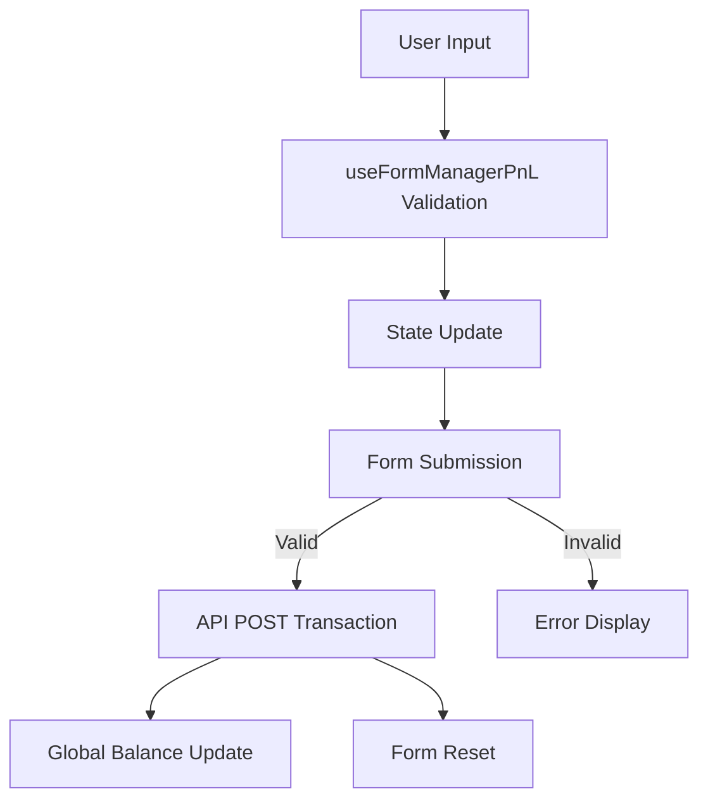
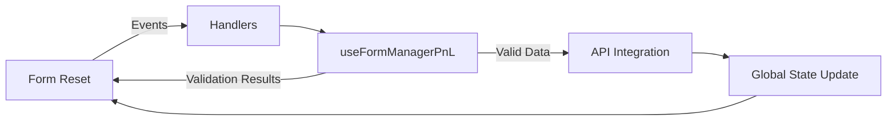
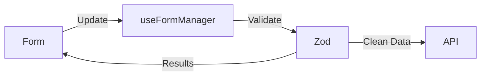
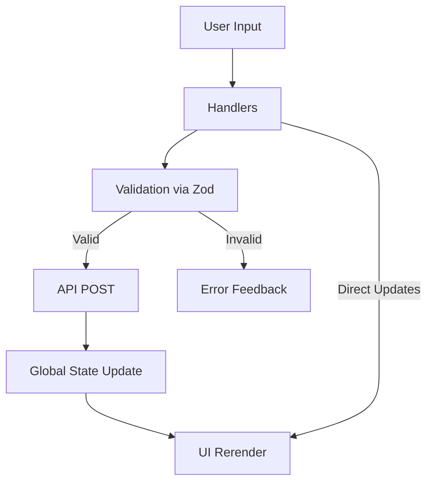

# FinTrack

## Objective

**FinTrack** is a personal finance application built as a "double-entry accounting system", offering a comprehensive and intuitive solution for managing your money.

Its primary goal is to provide users with effective tools to track expenses, incomes, investments, debts and bank accounts; keeping records of the interactions among the different accounts and maintaining all balances updated and reconciled.

As a double-entry accounting system, it automatically reflects the updated balances of all related accounts as soon as a transaction is recorded, ensuring that your financial overview is always accurate and up to date.

FinTrack also helps users monitor savings goals and investments. 🎯📊💡

## Key Features

1. **Expenses and Income**:

   - Detailed tracking of expenses and income.
   - Categorization by categories and dates.

2. **Investment and Debt Management**:

   - Track current investments.
   - Debts records classified in debtors or lenders. 

3. **Account Balance**:

   - View updated balances for all your financial accounts.
   - Compare income and expenses in real-time.

4. **Savings Goals**:

   - Set up personalized savings goals.
   - Monitor progress toward achieving goals.

5. **Investment Projections** (not included in this version):

   - Evaluate investment scenarios based on historical data and future estimates.
   - Analyze long-term financial objectives.

6. **Income Sources**:
   - Record and manage multiple income sources.
   - Clear visualization of contributions to overall balances.

## System Requirements

- Node.js >= 18
- Vite as the development server
- React >= 18.3
- TypeScript

🌐💻📋

## Installation

1. Clone this repository:

   bash
   git clone https://github.com/your-username/fintrack.git
   

2. Navigate to the project directory:

   bash
   cd fintrack
   

3. Install dependencies:
   bash
   npm install
   

📥🛠️🚀

## Available Scripts

- `npm run dev`: Starts the development server.
- `npm run build`: Builds the production version.
- `npm run lint`: Runs the linter to ensure clean code.
- `npm run preview`: Previews the built application.

⚙️✅🔧

## Technologies Used

- **React**: To build the user interface.
- **TypeScript**: To ensure robust and typed code.
- **Vite**: As an ultra-fast bundler and development server.
- **React Router**: To handle navigation.
- **React Select and Datepicker**: To enhance the user experience with interactive components.
- **date-fns**: For date manipulation and formatting.

🖥️📦✨

## Contribution

Contributions are welcome! Please follow these steps:

1. Fork the repository.
2. Create a branch for your feature: `git checkout -b new-feature`.
3. Make the changes and commit with descriptive messages.
4. Submit a Pull Request.

🤝📜🛠️

## License

This project is licensed under the terms of the [MIT License](LICENSE). 📄⚖️🆓

---

**FinTrack**: Your intelligent ally for taking control of your personal finances. 💡💼📊

7. **A WORD FOR DEVELOPERS**:
## Overview
For entering the data, FinTrack consists of 9 form pages, each developed with different learning approaches, which will be described as follow:

# FINTRACK FORM ARCHITECTURE: DEBTS.TSX IMPLEMENTATION CUSTOMIZED WITH NO THIRD PARTY LIBRARIES.

## Core Implementation

### Key Structural Blocks
1. **State Management**  
   - Local state for form data (`datatrack`, `formData`)  
   - Validation state (`validationMessages`, `showValidation`)  
   - Global balance state (Zustand)  

2. **Data Flow**  
   - Custom hooks for API calls (`useFetch`, `useFetchLoad`)  
   - Manual validation pipeline (no external validation libraries)  
   - Side effects for validation coordination  

3. **UI Components**  
   - `TopCardZod`: Amount input + debtor selection  
   - `DropDownSelection`: Account picker  
   - `CardNoteSave`: Note field + submit button  

### Validation Approach
- **Custom validation functions**:  
  `validateAmount`, `checkNumberFormatValue`, `validationData`  
- **Two-phase validation**:  
  1. Field-level during input  
  2. Full-form on submission  

### Key Data Flows
mermaid
graph TD
    A[User Input] --> B[Field Validation]
    B --> C[State Update]
    C --> D[Form Submission]
    D -->|Valid| E[API POST]
    D -->|Invalid| F[Error Display]
    E --> G[Global State Update]


## Technical Notes
- **No external validation libraries** used - all validation logic is custom  
- State updates trigger dependent validations through `useEffect`  
- Form reset logic handles both UI and data states  

## Component Relationships
mermaid
graph LR
    UI[Form Components] -->|Events| H[Handlers]
    H --> V[Validation]
    V -->|Errors| UI
    V -->|Valid Data| A[API]
    A --> S[Global State]
    S --> UI


This implementation shows a self-contained validation system integrated with React's state management, using manual checks instead of validation libraries.

# FinTrack Form Architecture: PnL.tsx Implementation with Custom Validation

## Core Implementation

### Key Structural Blocks
1. **State Management**  
   - Local state for form data (`formInputData`, `formValidatedData`)  
   - Validation state (`validationMessages`, `showValidation`)  
   - Global balance state (Zustand via `useBalanceStore`)  

2. **Data Flow**  
   - Custom hooks for API calls (`useFetch`, `useFetchLoad`)  
   - Centralized validation via `useFormManagerPnL` custom hook  
   - Side effects for validation coordination  

3. **UI Components**  
   - `TopCardZod`: Amount input + account selection  
   - `Datepicker`: Date selection component  
   - `CardNoteSave`: Note field + submit button  

### Validation Approach
- **Custom validation hook**: `useFormManagerPnL` handles all validation logic
- **Two-phase validation**:
  1. Field-level validation during input
  2. Full-form validation on submission
- **Zod integration** for schema validation (implied by component names)

### Key Data Flows



## Technical Implementation Details

### Form Management
- Custom `useFormManagerPnL` hook centralizes all form state and validation
- Handler factories (`createInputNumberHandler`, `createDropdownHandler`) for consistent input handling
- Type-safe validation with TypeScript interfaces

### API Integration
- Fetches account data for dropdown options
- Posts transaction data to `movement_transaction_record` endpoint
- Updates global balance store after successful transactions

### Component Architecture
- **TopCardZod**: Handles amount input, account selection, and currency selection
- **Datepicker**: Custom date selection component
- **CardNoteSave**: Manages note input and submit functionality

## Component Relationships



## Key Features
- Custom validation system without external validation libraries
- Real-time feedback for user inputs
- Automated form reset after successful submission
- Global state synchronization with backend data
- Type-safe throughout with extensive TypeScript interfaces

This implementation demonstrates a robust form handling system with custom validation logic, seamless API integration, and responsive user feedback, all while maintaining type safety and clean component separation.


# FINTRACK FORM ARCHITECTURE: EXPENSE.TSX CASE STUDY (Zod validation)

## Overview
 The `Expense.tsx` component demonstrates an organic evolution pattern that balances reusability with context-specific needs.

## Development Approach
### Evolutionary Pattern

Initial Version (all in component)  
  │  
  ├─→ Extracted Hooks (generic logic)  
  └─→ Ad-hoc Logic (context-specific parts)


### Key Characteristics
1. **Foundational Implementation**:
   - Started with declarative functions solving immediate needs
   - Basic state management and validation built directly in component

2. **Strategic Abstraction**:
   - Custom hooks created for obviously reusable logic:
     - `useFetch`/`useFetchLoad` for API calls
     - `useDebouncedCallback` for validation
   - Component retained:
     - Specialized handlers
     - Data transformation logic
     - UI coordination

## Architectural Flow

mermaid
graph TD
    A[User Input] --> B[Handlers]
    B --> C[Validation]
    C -->|Valid| D[API POST]
    C -->|Invalid| E[Error Feedback]
    D --> F[Global State]
    F --> G[UI Update]
    B -->|Direct Updates| G


## Key Design Decisions

| Feature | Implementation | Rationale |
|---------|---------------|-----------|
| **Typing** | Generics (`<TInput, TValidated>`) | Type safety in handlers |
| **Logic Separation** | Hybrid approach | Balance between reuse and clarity |
| **Optimizations** | `useMemo` + precise `useEffect` | Performance-critical sections |
| **Validation** | Zod schema + debounced checks | Real-time feedback without lag |

## Current State
The component represents a pragmatic hybrid architecture where:
- Reusable logic is properly abstracted
- Context-sensitive operations remain visible
- Data flows are explicitly tracked
- Type safety is enforced throughout
 

This documentation shows how I evolved from a monolithic implementation to a structured yet practical architecture, serving as a reference pattern for other forms in the application.


# FINTRACK: INCOME COMPONENT (ZOD VALIDATION)

## Core Implementation

### Validation Architecture
1. **Zod Integration**
   - Schema definition in `incomeSchema`
   - Type-safe validation with `IncomeValidatedDataType`
   - Used through `useFormManager` hook

2. **Validation Layers**
   ```mermaid
   graph TD
       A[Field Input] --> B[Zod Schema]
       B -->|Valid| C[API Submission]
       B -->|Invalid| D[Error Display]
   ```

### Key Components
| Component | Responsibility | Zod Usage |
|-----------|----------------|-----------|
| `useFormManager` | Central validation handler | Wraps Zod validation |
| `TopCardZod` | Input handling | Uses Zod-validated fields |
| `onSaveHandler` | Submission logic | Calls Zod `validateAll()` |

## Technical Highlights
1. **Hybrid Validation**
   - Zod for schema validation
   - Custom logic for:
     - Conditional field requirements
     - Cross-field validation
     - UI state management

2. **Type Safety**
   ```typescript
   // Zod schema provides type inference
   const { dataValidated } = validateForm(incomeSchema, formData);
   // dataValidated is typed as IncomeValidatedDataType
   ```

## Data Flow


This implementation effectively combines Zod's schema validation with custom form management logic.
//-----------------------------------

# FINTRACK FORM ARCHITECTURE: `TRANSFER.TSX` CASE STUDY

## Overview

The `Transfer.tsx` component is designed to manage asset transfers between different account types. Its architecture demonstrates a structured approach that separates responsibilities and leverages reusable logic.

## Development Approach
### Architectural Pattern

The component implements a **hybrid architecture** that combines a central state management hook with context-specific logic.

Initial Implementation
  │
  ├─→ Extracted Hooks (reusable logic)
  └─→ Ad-hoc Logic (specialized component logic)

### Key Characteristics
1. **Logic Centralization**:
    * Core form logic, including state management and validation, is housed in the custom hook **`useFormManager.ts`**.
    * The `Transfer.tsx` component maintains logic specific to its unique requirements, such as handling account type changes and filtering account options.

2. **Validation with Zod**:
    * The **`transferSchema`** from Zod defines the validation rules for all form fields.
    * The schema includes a custom **`.refine`** method to ensure the origin and destination accounts are not the same.

## Architectural Flow


## I would use in the future either PnL.tsx for custom validated approach or Transfer.tsx for zod validation usage.
this was already accomplished, considering different approachs in the sake of learning different techniques.

Theoretically, all the operations of tracking could be performed just using "Transfer" function from tracker menu, with just little adjustments, without the need of the others tracker options.

## VIEW ACCOUNT DETAILS IN ACCOUNTING DASHBOARD
VIEW DETAILS:
Different approaches were applied for rendering detail info of the accounts, in order to compare and learn.

The system employs a Hybrid Data Fetching Pattern 

 The AccountingDashboard fetches account data and transfers it via navigation state. This state-based data serves as the primary, fastest source for the detail views. For generic accounts (AccountDetail), the full account object is passed, allowing for an immediate render.
 
  Conversely, for specific accounts (CategoryDetail), the dashboard passes a null value. This action forces the detail component to initiate an API Fallback using useFetch to retrieve complex, dynamic data directly from the server, ensuring data validity. All detail components use the same consumption logic (StateData || FetchResult) to handle both the instant load from state and the slower, resilient fetch from the API when state data is absent (e.g., after a page refresh).

  In PocketDetail, the account id is passed via parameters, and info account is always fetch using useFetch hook. 

  
## EDITION.
ACCOUNT EDITION PHILOSOPHY
To maintain financial integrity and keep the application simple, the account editing module focuses on non-critical fields. Critical fields such as the account balance, account type, starting date, and initial amount are deliberately non-editable.

If a change to this core data is required, the application enforces the use of auditable mechanisms supplied, such as:

Creating new direct or reversal transactions (Transfers or PnL adjustments).

Or Using the Atomic Hard Delete feature to safely remove an erroneous account and recreate it correctly.
 
  
## DELETION.
It was very interesting to evaluate the different methods that could be applied to manage account deletion and maintain the system integrity.

As a case of study, following is a comparative table of deletion methods evaluated.

For this app, the method number 4, Retrospective Total Annulment (RTA) was chosen, following the criteria of deletion of account only for critical data correction or emergency use cases. 

📖 ACCOUNT DELETION METHODS: DOUBLE-ENTRY Accounting Implications
This document describes the various approaches to deleting accounts, classifying their impact on the integrity of the double-entry bookkeeping system and the balance of active accounts (account_balance).

1. Soft Delete (Logical Deletion)
The Soft Delete is the safest and least destructive approach. Instead of physical removal, the account row is simply marked with a deleted_at timestamp.

Main Purpose: Archiving and Reversibility. It is used to inactivate unused accounts.

Impact on Active Balance: The balance of active accounts remains unaltered (None).

CASCADE Effect: None. All transaction history is retained.

Advantage: The account is Fully Auditable and Reversible.

Best Practice / Role: Standard for the End-User.

2. Hard Delete Classic (Simple Physical Deletion)
This method involves direct physical deletion (DELETE) without any compensating accounting logic.

Main Purpose: Simple space release.

Impact on Active Balance: Causes Immediate Corruption in double-entry bookkeeping. By deleting a transaction (e.g., an expense) without compensating for the cash outflow, the active balance is broken.

CASCADE Effect: Total. The account and all associated transactions are deleted.

Disadvantage: Unusable in Accounting. It destroys active balance integrity.

Best Practice / Role: None (Only for testing/development).

3. Hard Delete Atomic (Balance Preservation)
This is the accepted best practice method for hard deletion in accounting systems. It combines physical deletion with an atomic settlement to maintain balance integrity.

Main Purpose: Destroy Detailed History of the Target account, but MAINTAIN the current financial reality of active accounts.

Impact on Active Balance: The active balance is Preserved (None). A single PnL/Slack transaction (neutralizing adjustment) is inserted immediately before the final DELETE to exactly neutralize the impact of the deleted transactions.

CASCADE Effect: Total. The detailed history is replaced by the single PnL entry.

Advantage: Safe and Atomic. It adheres to the Core Accounting Principle of preserving the final balance.

Best Practice / Role: Accepted by Double-Entry Accounting. (Admin/Maintenance).

4. Retrospective Total Annulment (RTA)
This method focuses on the retroactive correction of balances, fulfilling the intent that the Target account's interactions "never existed."

Main Purpose: Rewrite History and retroactively annul all effects of the Target account, deliberately altering the final balance.

Impact on Active Balance: The active balance Changes (Corrected). The PnL/Slack entry reverses the net flow (e.g., increasing the Bank balance from $500 to $600 by annulling a $100 expense).

CASCADE Effect: Total. The detailed history is deleted and replaced by the correcting PnL entry.

Disadvantage: Destroys Historical Reality. The new balance was not the true financial state in the past.

Best Practice / Role: Administrator/Audit (Emergency use for data correction).

5. RTA with History Retention (RTA-RH)
A complex, specialized variant of RTA that prioritizes the retention of all historical records, even after annulment.

Main Purpose: Annul the effect on the balance while maintaining an immutable record of the original interaction for internal audit or compliance.

Impact on Active Balance: The balance Changes (Corrected), similar to RTA.

CASCADE Effect: None/Conditional. Transactions are retained but are marked (e.g., status='annulled').

Disadvantage: High Risk of Double Counting. This creates extreme complexity in reporting, as the transaction history no longer sums up to the recorded balance.

Best Practice / Role: Database Admin/Maintenance. (Only for specific legal retention requirements).